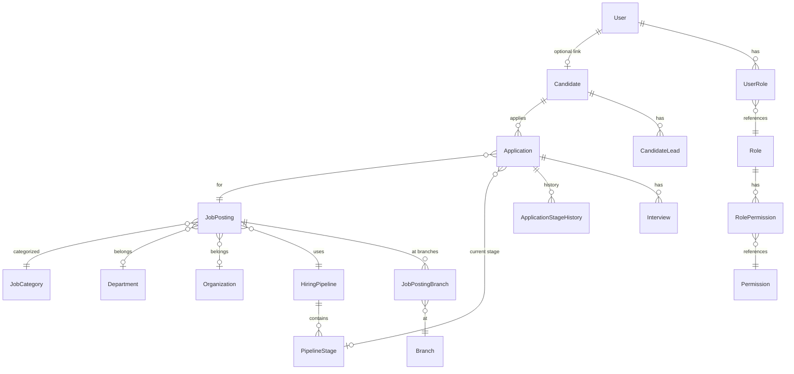

# ATS Architecture Discovery Report

**Iteración 0 — Discovery**
**Fecha:** 2026-08-20
**Estado:** Análisis completo, pendiente de aprobación para avanzar a Iteración 1

---

## 1. Executive Summary

El proyecto ATS para AMA Hospital es un sistema de seguimiento de candidatos en fase de desarrollo temprano. Tiene código funcional parcial, un esquema Prisma con ~20 modelos, y una intención arquitectónica DDD que está **parcialmente implementada pero con inconsistencias significativas**.

El principal hallazgo es que el proyecto está en un estado de **experimentación arquitectónica**: se han explorado múltiples aproximaciones en paralelo (3 versiones distintas del flujo de Application) sin consolidar ninguna. Existe una tensión no resuelta entre la ambición SaaS multi-tenant y la realidad de que ni siquiera existe un `tenant_id` en el esquema.

> [!CAUTION]
> **Riesgo crítico identificado:** El proyecto está construyendo infraestructura y patrones antes de haber definido con claridad su modelo de dominio. Se están introduciendo capas DDD (aggregates, domain events, repositories, use cases) sin que exista aún una comprensión estabilizada de los conceptos fundamentales del negocio.

---

## 2. Product Understanding

### 2.1 Propósito
Sistema ATS inicialmente para AMA Hospital (sector hospitalario/médico), con ambición futura de convertirse en SaaS multi-tenant configurable para múltiples industrias.

### 2.2 Usuarios/Actores identificados

| Actor | Descripción | Estado actual |
|---|---|---|
| **Recruiter** | Crea vacantes, gestiona candidatos, mueve pipeline | Parcialmente implementado |
| **Admin** | Gestión global del sistema | Solo definido en seed/roles |
| **Candidate** | Aplica a vacantes, sigue estado | Sin portal implementado |
| **Hiring Manager** | Aprueba vacantes, participa en selección | No modelado |
| **Interviewer** | Participa en entrevistas | Parcialmente (Interview model) |
| **Platform Admin** | Admin de la plataforma SaaS | No modelado |

### 2.3 Workflows documentados (en [use-cases.md](file:///c:/Users/brand/Documents/Proyectos%20de%20programaci%C3%B3n/AMA%20Hospital/ats-app/data/use-cases.md))

9 flujos fueron diseñados:

1. Publicar vacante
2. Aplicación directa (web)
3. Lead manual (Facebook, etc.)
4. Convertir Lead → Application
5. Registro de cuenta (opcional)
6. Aplicación con usuario logueado
7. Reclutador crea Application manual
8. Cerrar vacante
9. Limpieza / anti-basura

### 2.4 Límites del MVP
No están formalmente definidos. El seed data y las páginas implementadas sugieren un MVP centrado en:
- Listado público de vacantes (parcialmente implementado)
- Gestión interna de applications (parcialmente)
- Pipeline de stages (parcialmente)

---

## 3. Current Architecture

### 3.1 Estructura del repositorio

```
src/
├── app/                    # Next.js App Router
│   ├── (auth)/             # Login, Register
│   ├── (protected)/        # admin, candidate, recruiter, onboarding, dashboard-old
│   ├── (public)/           # /, jobs, explore, departments
│   ├── (fallbacks)/        # unauthorized
│   ├── actions/            # 1 server action (apply-to-job.ts)
│   └── api/                # applications, auth, jobs
│
├── domain/                 # Entities, events, types, errors
│   ├── application/        # Aggregate, entity(=events), errors, types
│   ├── auth/               # permissions.ts
│   ├── enums/              # employment-type, seniority-level
│   ├── jobs-posting/       # EMPTY
│   ├── pipeline/           # pipeline-engine.ts
│   └── shared/             # mappers/ (empty)
│
├── application/            # Use cases, schemas, auth
│   ├── application/        # create-application, move-stage use cases + duplicates
│   ├── auth/               # authorization.service, guards
│   ├── common/             # context type (implied)
│   ├── job-posting/        # dto/, queries/, schemas/, use-cases/
│   ├── schemas/            # (not inspected)
│   ├── services/           # (not inspected)
│   └── shared/             # (not inspected)
│
├── core/                   # Service + Repository contracts + business rules
│   ├── application/        # service, repository, query, rules, types
│   ├── auth/               # abac.ts
│   ├── candidate/          # service, repository, rules, schema, types
│   └── pipeline/           # service, rules, types
│
├── infrastructure/
│   ├── database/           # prisma.client.ts, prisma.service.ts
│   ├── auth/               # auth.server, auth.client, auth.service, route.guards, create-context
│   ├── audit/              # audit.service.ts
│   └── prisma/repositories/  # application.repository.ts (aggregate-based)
│
├── components/             # UI components (shadcn, sections, auth, modals)
├── interfaces/             # http/, ui/
├── hooks/                  # (empty)
├── presentation/           # hooks/
├── shared/                 # db/, types/, utils/
├── ui/                     # (purpose unclear - duplicates components/ui?)
├── config/                 # app.ts (env)
├── lib/                    # auth.ts, auth-client.ts, env.ts, shared.ts, utils.ts
├── styles/                 # globals.css
├── utils/                  # helpers
└── generated/prisma/       # Auto-generated
```

### 3.2 Architectural Layers

> [!WARNING]
> **El proyecto tiene al menos 4 capas diferentes intentando resolver el mismo problema, con responsabilidades superpuestas y código duplicado.**

| Layer | Location | Role | Problem |
|---|---|---|---|
| `domain/` | [domain/](file:///c:/Users/brand/Documents/Proyectos%20de%20programaci%C3%B3n/AMA%20Hospital/ats-app/src/domain) | Entities, events, errors | Imports Prisma types directly (`StageType` from generated) |
| `application/` | [application/](file:///c:/Users/brand/Documents/Proyectos%20de%20programaci%C3%B3n/AMA%20Hospital/ats-app/src/application) | Use cases | Duplicates error classes, imports Prisma directly |
| `core/` | [core/](file:///c:/Users/brand/Documents/Proyectos%20de%20programaci%C3%B3n/AMA%20Hospital/ats-app/src/core) | Services, repos, rules | **Is this "core" or "application"?** Overlaps both |
| `infrastructure/` | [infrastructure/](file:///c:/Users/brand/Documents/Proyectos%20de%20programaci%C3%B3n/AMA%20Hospital/ats-app/src/infrastructure) | Prisma, auth, audit | Also contains application-level logic |
| `interfaces/` | [interfaces/](file:///c:/Users/brand/Documents/Proyectos%20de%20programaci%C3%B3n/AMA%20Hospital/ats-app/src/interfaces) | HTTP wrappers | Purpose unclear |
| `lib/` | [lib/](file:///c:/Users/brand/Documents/Proyectos%20de%20programaci%C3%B3n/AMA%20Hospital/ats-app/src/lib) | Auth config, utils | Mixes infrastructure and shared |
| `shared/` | [shared/](file:///c:/Users/brand/Documents/Proyectos%20de%20programaci%C3%B3n/AMA%20Hospital/ats-app/src/shared) | DB types, utils | What's the difference vs `lib/`? |
| `presentation/` | [presentation/](file:///c:/Users/brand/Documents/Proyectos%20de%20programaci%C3%B3n/AMA%20Hospital/ats-app/src/presentation) | Client hooks | Barely used |

---

## 4. Current Domain Model (Prisma Schema)

### 4.1 Entities

| Model | Lines | Role |
|---|---|---|
| `User` | L10-30 | Auth user (Better Auth managed) |
| `Session` | L32-45 | Auth session |
| `Account` | L47-65 | OAuth account |
| `Verification` | L67-77 | Email verification |
| `Role` | L79-86 | Role definition |
| `Permission` | L88-94 | Permission definition |
| `UserRole` | L96-105 | User-Role junction |
| `RolePermission` | L107-116 | Role-Permission junction |
| `Candidate` | L118-148 | Candidate profile |
| `CandidateLead` | L150-164 | Lead tracking |
| `Application` | L166-193 | Application to a job |
| `ApplicationSource` | L195-207 | Source catalog |
| `JobPosting` | L209-256 | Job posting |
| `Department` | L258-270 | Department (hierarchical) |
| `Organization` | L272-281 | Organization (minimal) |
| `Branch` | L283-297 | Physical location |
| `JobPostingBranch` | L299-308 | Job-Branch junction |
| `JobCategory` | L310-319 | Job classification |
| `HiringPipeline` | L321-330 | Pipeline template |
| `PipelineStage` | L332-350 | Stage within pipeline |
| `ApplicationStageHistory` | L352-370 | Stage transition log |
| `Interview` | L372-390 | Interview record |
| `AuditLog` | L392-408 | Audit trail |

### 4.2 Entity Relationship Diagram



---

## 5. Existing Decisions (Extracted)

| # | Decision | Source | Status |
|---|---|---|---|
| D1 | Next.js 16 App Router | `package.json` | ✅ Implemented |
| D2 | Better Auth for authentication | `auth.ts` | ✅ Implemented |
| D3 | Prisma with PrismaPg adapter | `prisma.client.ts` | ✅ Implemented |
| D4 | RBAC via Role/Permission tables | Schema | ✅ Implemented |
| D5 | Candidate can exist without User | Schema (`userId?`) | ✅ Designed |
| D6 | CandidateLead as separate entity | Schema + flows | ✅ Designed |
| D7 | DDD with aggregate pattern | `ApplicationAggregate` | ⚠️ Partial |
| D8 | SSR-first, no client state (Redux/Zustand) | `jobs.md` | ✅ Decision |
| D9 | Server Actions over API Routes for mutations | `jobs.md` | ⚠️ Mixed |
| D10 | `any` types acceptable in rules/ABAC | Multiple files | ❌ Anti-pattern |
| D11 | Hospital-specific departments | Seed data | ⚠️ Conflicts with SaaS goal |

---

## 6. Architectural Problems

### 6.1 CRITICAL: Three Competing Application Service Implementations

> [!CAUTION]
> There are **three different implementations** of "create application" logic, using three different patterns:

| File | Pattern | How it works |
|---|---|---|
| [core/application/application.service.ts](file:///c:/Users/brand/Documents/Proyectos%20de%20programaci%C3%B3n/AMA%20Hospital/ats-app/src/core/application/application.service.ts) | Service Object | `ApplicationService.applyToJob()` — procedural, uses Prisma directly |
| [application/application/create-application.use-case.ts](file:///c:/Users/brand/Documents/Proyectos%20de%20programaci%C3%B3n/AMA%20Hospital/ats-app/src/application/application/create-application.use-case.ts) | Use Case function | `createApplicationUseCase()` — procedural, uses Prisma directly |
| [app/actions/apply-to-job.ts](file:///c:/Users/brand/Documents/Proyectos%20de%20programaci%C3%B3n/AMA%20Hospital/ats-app/src/app/actions/apply-to-job.ts) | Use Case class + Aggregate | `ApplyToJobUseCase` — uses `ApplicationRepository` with aggregate & domain events |

**This is the clearest symptom of architectural indecision.** The team (or AI agents) tried different approaches and left all of them in place.

### 6.2 CRITICAL: Domain Layer Depends on Prisma Generated Types

The domain layer should be the innermost layer, independent of infrastructure. Currently:

- [pipeline-engine.ts](file:///c:/Users/brand/Documents/Proyectos%20de%20programaci%C3%B3n/AMA%20Hospital/ats-app/src/domain/pipeline/pipeline-engine.ts#L1): `import { StageType } from "@/generated/prisma/client"` — Domain depends on Prisma.
- [employment-type.enum.ts](file:///c:/Users/brand/Documents/Proyectos%20de%20programaci%C3%B3n/AMA%20Hospital/ats-app/src/domain/enums/employment-type.enum.ts#L1): `import { EmploymentType } from "@/generated/prisma/enums"` — Domain depends on Prisma.
- [candidate.rules.ts](file:///c:/Users/brand/Documents/Proyectos%20de%20programaci%C3%B3n/AMA%20Hospital/ats-app/src/core/candidate/candidate.rules.ts#L1): `import { Candidate } from "@/generated/prisma/client"` — Business rules depend on Prisma types.

**This violates Dependency Inversion** and makes the domain layer a thin wrapper around Prisma rather than an independent business model.

### 6.3 HIGH: `core/` Directory Is Architecturally Confused

The `core/` directory contains:
- Service objects (application logic)
- Repository implementations (infrastructure concern)
- Business rules (domain concern)
- Type definitions (shared concern)
- ABAC functions (authorization concern)

**It is simultaneously trying to be domain, application, and infrastructure.** This is the primary source of confusion in the codebase.

### 6.4 HIGH: `any` Types Throughout Business Logic

- [abac.ts](file:///c:/Users/brand/Documents/Proyectos%20de%20programaci%C3%B3n/AMA%20Hospital/ats-app/src/core/auth/abac.ts): `function canMoveApplication(user: any, application: any)`
- [pipeline.rules.ts](file:///c:/Users/brand/Documents/Proyectos%20de%20programaci%C3%B3n/AMA%20Hospital/ats-app/src/core/pipeline/pipeline.rules.ts): `function ensureNotFinalStage(currentStage: any)`
- [application.rules.ts](file:///c:/Users/brand/Documents/Proyectos%20de%20programaci%C3%B3n/AMA%20Hospital/ats-app/src/core/application/application.rules.ts): `function ensureNotDuplicated(existing: any)`
- [application.query.ts](file:///c:/Users/brand/Documents/Proyectos%20de%20programaci%C3%B3n/AMA%20Hospital/ats-app/src/core/application/application.query.ts#L24): `const grouped = applications.reduce((acc: any, app) =>`

**Strict TypeScript mode is declared in the AGENTS.md rules but violated systematically.** The `any` types bypass all compile-time safety.

### 6.5 HIGH: Duplicate Error Classes

`ApplicationAlreadyExistsError`, `ApplicationNotFoundError`, `InvalidStageTransitionError` are defined in **two different files**:
- [domain/application/application.errors.ts](file:///c:/Users/brand/Documents/Proyectos%20de%20programaci%C3%B3n/AMA%20Hospital/ats-app/src/domain/application/application.errors.ts)
- [application/application/create-application.use-case.ts](file:///c:/Users/brand/Documents/Proyectos%20de%20programaci%C3%B3n/AMA%20Hospital/ats-app/src/application/application/create-application.use-case.ts#L5-L21)

### 6.6 HIGH: Misnamed File

[application.entity.ts](file:///c:/Users/brand/Documents/Proyectos%20de%20programaci%C3%B3n/AMA%20Hospital/ats-app/src/domain/application/application.entity.ts) actually contains `ApplicationEvent` type definitions, not an entity. The entity is actually the aggregate.

### 6.7 MEDIUM: No Multi-Tenant Support

The Prisma schema has **zero `tenant_id` fields**. Organization exists but is:
- Optional on JobPosting (`organizationId String?`)
- Not linked to User, Candidate, Role, Permission, Department, Branch, or Pipeline
- Not used for data isolation

**If this system ever becomes SaaS, essentially every model needs redesign.**

### 6.8 MEDIUM: Seed Script Calls `main()` Twice

[seed.ts](file:///c:/Users/brand/Documents/Proyectos%20de%20programaci%C3%B3n/AMA%20Hospital/ats-app/prisma/seed.ts#L218-L238) calls `main()` twice (lines 218 and 228), which would cause duplicate data or errors.

### 6.9 MEDIUM: StageType Enum Is Too Restrictive

```prisma
@@unique([pipelineId, type])  // Only ONE stage of each type per pipeline
```

This means a pipeline can only have **one** INTERVIEW stage, **one** SCREENING stage, etc. This is extremely limiting for real-world hiring processes that may need:
- Phone Screen → Technical Interview → Culture Interview → Panel Interview
- All of type "INTERVIEW" but impossible with current schema.

### 6.10 MEDIUM: `data/` Documentation Is AI Conversation Artifacts

The documentation in `/data` is **raw AI chat output**, not architectural documentation:
- [jobs.md](file:///c:/Users/brand/Documents/Proyectos%20de%20programaci%C3%B3n/AMA%20Hospital/ats-app/data/jobs.md) starts with "Sí—si ya tienes esquema, pásamelo después y lo ajustamos fino" — this is a chat response
- [use-cases.md](file:///c:/Users/brand/Documents/Proyectos%20de%20programaci%C3%B3n/AMA%20Hospital/ats-app/data/use-cases.md) starts with "Buena pregunta — aquí es donde muchos se adelantan"
- [profiles.md](file:///c:/Users/brand/Documents/Proyectos%20de%20programaci%C3%B3n/AMA%20Hospital/ats-app/data/profiles.md) contains Supabase SQL, suggesting the project previously used Supabase

**These are historical artifacts, not design documents.** They contain contradictory assumptions.

### 6.11 LOW: Empty/Placeholder Directories

- `domain/jobs-posting/` — empty
- `domain/shared/mappers/` — empty
- `hooks/` — empty (separate from `presentation/hooks/`)
- `ui/` — unclear purpose vs `components/ui/`

---

## 7. Domain Modeling Problems

### 7.1 Candidate ≠ User (Partially Resolved)

The schema correctly models `Candidate.userId` as optional, allowing candidates to exist without user accounts. **This is a good decision.** However:

- The relationship is `@unique` (1:1), meaning one user can only be one candidate — correct.
- But there's no mechanism for "claiming" a candidate profile (linking user to existing candidate after registration).
- The `email` on Candidate is not unique, which is correct for allowing duplicates to be detected rather than enforced, but no deduplication logic exists.

### 7.2 CandidateLead Concept Is Questionable

`CandidateLead` adds a sales-funnel concept (NEW → CONTACTED → QUALIFIED → CONVERTED) that overlaps with Application pipeline stages. A lead that gets "CONVERTED" becomes an Application — but this introduces:
- Two parallel state machines for the same person's journey
- Ambiguity about where source tracking belongs (Lead? Application? Candidate?)

**Recommendation:** This needs serious reconsideration. See Decision Backlog.

### 7.3 Job Model Conflation

`JobPosting` currently represents multiple concepts:
- **Position** (organizational role)
- **Requisition** (internal request to fill N positions)
- **Vacancy** (open position)
- **Job Posting** (public advertisement)

The `totalPositions` and `positionsFilled` fields suggest requisition behavior on a posting entity.

### 7.4 ABAC Is Hospital-Specific

The [abac.ts](file:///c:/Users/brand/Documents/Proyectos%20de%20programaci%C3%B3n/AMA%20Hospital/ats-app/src/core/auth/abac.ts) hardcodes:
```typescript
if (user.role === "DOCTOR") {
  return application.stage?.type === "INTERVIEW";
}
```

"DOCTOR" is a hospital-specific role. This directly contradicts the SaaS ambition.

### 7.5 No Privacy/Consent Model

Zero privacy infrastructure exists:
- No consent records
- No data processing purposes
- No data retention policies
- No privacy policy versioning
- No mechanism to handle GDPR/LFPDPPP obligations

---

## 8. Authentication Problems

### 8.1 Better Auth Integration

The integration is functional but shallow:
- Email/password ✅
- Magic link ✅ (but `sendMagicLink` is empty — no email actually sent)
- Google OAuth ✅ (configured)
- No organization/tenant plugin
- No candidate-specific auth flow
- No account claiming mechanism

### 8.2 Auth ↔ Domain Coupling

Better Auth manages `User`, `Session`, `Account`, `Verification` tables directly. The Prisma schema includes these as models, which means:
- Auth infrastructure defines domain model shape
- Schema changes to User require coordinating with Better Auth
- No port/adapter boundary exists

### 8.3 No Candidate Auth

There is no mechanism for candidates to:
- Track their applications
- Access a candidate portal
- Reclaim existing profiles
- Use passwordless auth specifically for the candidate flow

---

## 9. Candidate/Application Problems

### 9.1 Application Requires Login

The current `applyToJob` server action (in [core/application/application.service.ts](file:///c:/Users/brand/Documents/Proyectos%20de%20programaci%C3%B3n/AMA%20Hospital/ats-app/src/core/application/application.service.ts)) and the use-case flows assume `userId` is available. The [jobs.md](file:///c:/Users/brand/Documents/Proyectos%20de%20programaci%C3%B3n/AMA%20Hospital/ats-app/data/jobs.md) documentation explicitly shows:

```typescript
const user = await auth()
if (!user) throw new Error("Unauthorized")
```

**This forces candidate registration before application**, which contradicts the use-case documentation (Flow 2) that shows guest applications.

### 9.2 Deduplication Strategy Is Absent

- `Candidate.email` is not unique (has `@@index` but no `@unique`)
- No CURP field
- No phone-based dedup logic in the schema
- `CandidateRepository.findByEmail()` uses `findUnique` but email isn't unique — **this will fail at runtime**

### 9.3 Application Source Tracking Is Over-Engineered Yet Incomplete

Source is tracked in 3 places:
- `Candidate.sourceId` — candidate's original source
- `CandidateLead.sourceId` — lead's source
- `Application.sourceId` — application's source

But there's no clear policy on which takes precedence or how they relate.

---

## 10. Multi-Tenant Problems

### 10.1 No Tenant Model

There is no `Tenant` entity. `Organization` exists but is:
- Minimal (name, website, logoUrl)
- Not linked to users, roles, departments, branches, or candidates
- Optional on job postings

### 10.2 No Data Isolation

Without `tenant_id`:
- All candidates are globally shared
- All departments are globally shared
- All pipelines are globally shared
- A query for "all applications" returns every tenant's data

### 10.3 Roles/Permissions Are Global

`Role` and `Permission` are global entities. In a SaaS:
- Each tenant should have their own roles
- Permissions should be scoped
- Organization membership should determine access

---

## 11. Privacy Concerns

### 11.1 LFPDPPP (Mexico) Requirements Not Addressed
- No privacy notice acceptance tracking
- No consent granularity (purpose-specific consent)
- No data processing lawful basis records
- Candidates created by recruiters (via WhatsApp, phone) have no consent trail

### 11.2 Candidate CV Data
- `cvUrl` and `cvRaw` stored with no access controls
- `cvParsedData` as `Json?` has no schema validation
- No data retention or deletion mechanism

---

## 12. Scalability Concerns

### 12.1 Pipeline Stage Uniqueness
`@@unique([pipelineId, type])` limits to 6 stages (one per StageType). Real ATS needs 8-15+ stages.

### 12.2 No Pagination
[application.query.ts](file:///c:/Users/brand/Documents/Proyectos%20de%20programaci%C3%B3n/AMA%20Hospital/ats-app/src/core/application/application.query.ts#L15) uses `findMany` without limits — will degrade with volume.

### 12.3 Audit Log Growth
Audit logs have no archival strategy, partition, or TTL.

---

## 13. Technical Debt

| Item | Severity | Location |
|---|---|---|
| Triple implementation of Application creation | 🔴 Critical | `core/`, `application/`, `app/actions/` |
| `any` types in business rules | 🔴 Critical | `abac.ts`, `pipeline.rules.ts`, `application.rules.ts` |
| Domain depends on Prisma | 🔴 Critical | `pipeline-engine.ts`, `employment-type.enum.ts` |
| Duplicate error classes | 🟡 High | `domain/` vs `application/` |
| Misnamed files | 🟡 High | `application.entity.ts` = events |
| Empty directories | 🟢 Low | `domain/jobs-posting/`, `hooks/` |
| Seed runs `main()` twice | 🟡 High | `seed.ts` |
| `candidateRepository.findByEmail` uses `findUnique` on non-unique field | 🔴 Critical | `candidate.repository.ts` |
| Supabase remnants in documentation | 🟢 Low | `profiles.md` |
| Hospital-specific ABAC roles | 🟡 High | `abac.ts` |

---

## 14. Decisions That Must Be Made

### 14.1 Critical — Blocks Architecture

| # | Decision | Why It's Blocking |
|---|---|---|
| **C1** | **Candidate vs User identity model** | Determines auth flows, data model, privacy, portal |
| **C2** | **Guest application vs registration-required** | Determines entire candidate UX and conversion funnel |
| **C3** | **Multi-tenant strategy** | Determines every table schema, every query, every authorization check |
| **C4** | **Organization hierarchy model** | Determines how jobs, departments, branches relate to tenants |
| **C5** | **Consolidate the architecture pattern** | Must pick ONE approach: aggregate+events, service objects, or use case functions |

### 14.2 High — Blocks Module Implementation

| # | Decision |
|---|---|
| **H1** | Job vs Requisition vs Posting separation (or not) |
| **H2** | CandidateLead: keep, merge into Application, or redesign? |
| **H3** | Pipeline stage flexibility (remove StageType unique constraint?) |
| **H4** | RBAC scope (global vs per-tenant vs per-org) |
| **H5** | Privacy/consent model design |
| **H6** | Candidate deduplication strategy |

### 14.3 Medium — Can Be Deferred

| # | Decision |
|---|---|
| **M1** | Candidate portal design |
| **M2** | Interview scheduling model |
| **M3** | Offer management model |
| **M4** | Metrics/analytics strategy |
| **M5** | External integrations architecture |

---

## 15. Questions Answerable From The Repository

| Question | Answer |
|---|---|
| Does the project use Next.js App Router? | Yes, Next.js 16 |
| Does authentication work? | Better Auth is configured and integrated |
| Is there a working public job board? | Partially — page exists at `/jobs` |
| Is there a recruiter dashboard? | Partially — route exists at `/recruiter` |
| Are there database migrations? | Yes, `prisma/migrations/` directory exists |
| Is the pipeline configurable? | Partially — `HiringPipeline` + `PipelineStage` exist but StageType enum is limiting |
| Does the domain layer exist? | Skeleton exists but is contaminated with Prisma types |
| Are there tests? | **No.** No test files, no test config, no test dependencies |
| Is there a CI/CD pipeline? | **No.** |

---

## 16. Questions That Require Product Input

| # | Question | Impact |
|---|---|---|
| Q1 | For the MVP, is this single-tenant (AMA Hospital only) or must it already support multiple tenants? | Determines schema complexity |
| Q2 | Must candidates register to apply, or is guest application the priority? | Determines auth architecture |
| Q3 | Does AMA Hospital currently have defined hiring pipelines, or should the system impose a default? | Determines pipeline flexibility |
| Q4 | How many simultaneous job postings are expected? (5? 50? 500?) | Determines performance approach |
| Q5 | Who are the primary users for the MVP? (Only recruiters? Also hiring managers?) | Determines role model |
| Q6 | Should the public job portal show AMA Hospital branding or be white-label ready? | Determines public UI architecture |
| Q7 | Is there an existing HRIS or payroll system to integrate with? | Determines hiring → employee boundary |
| Q8 | What's the current candidate volume? (10/week? 100/week? 1000/week?) | Determines performance and dedup priority |

---

## 17. Recommended Next Iteration

### Iteración 1 — Domain & Product Redesign

The next iteration should **not touch code**. It should produce:

1. **Consolidated Domain Model** — Resolve the Candidate/User/Application identity crisis
2. **Bounded Context Map** — Define clear contexts and their relationships
3. **Organization Model Decision** — Design the multi-tenant hierarchy
4. **Pipeline Model Redesign** — Remove StageType rigidity
5. **Privacy Model Sketch** — Minimum viable consent infrastructure
6. **Architecture Pattern Consolidation** — Choose ONE pattern for service/use-case/aggregate

---

## Decision Backlog

### 🔴 Critical — Blocks Architecture

| ID | Decision | Options | Notes |
|---|---|---|---|
| C1 | Candidate ↔ User identity | Separate with optional link (current) vs Merged vs Identity graph | Current direction is sound but needs formalization |
| C2 | Guest application flow | Require registration vs Guest + claim vs Magic link auto-create | **Highest UX impact decision** |
| C3 | Multi-tenant strategy | Single-tenant MVP → add later vs Tenant from day 1 | Recommend single-tenant MVP with tenant-ready schema |
| C4 | Organization hierarchy | Flat (Tenant→Org) vs Deep hierarchy vs Organization units | Industry-specific needs vary |
| C5 | Architecture consolidation | Aggregate + Events vs Service Objects vs Use Case functions | Must choose ONE |

### 🟡 High — Blocks Module

| ID | Decision | Notes |
|---|---|---|
| H1 | Job/Requisition/Posting separation | Recommend: JobPosting for MVP, separate later |
| H2 | CandidateLead model | Recommend: Remove, fold source tracking into Application |
| H3 | Pipeline stage flexibility | Recommend: Remove StageType enum, use labels |
| H4 | RBAC scope | Recommend: Scoped per tenant from start |
| H5 | Privacy model | Recommend: ConsentRecord + PolicyVersion minimum |
| H6 | Deduplication strategy | Recommend: Email + phone composite, manual merge UI |

### 🟢 Medium — Can Defer

| ID | Decision |
|---|---|
| M1 | Candidate portal UX |
| M2 | Interview scheduling complexity |
| M3 | Offer workflow |
| M4 | Analytics approach |
| M5 | External integrations (LinkedIn, Indeed) |

### ⚪ Low — Future

| ID | Decision |
|---|---|
| L1 | AI-assisted screening |
| L2 | CV parsing |
| L3 | Semantic search |
| L4 | Event sourcing (probably unnecessary) |

---

## Preliminary Recommendation

### Vision

The architecture should evolve toward a **modular monolith** with:

1. **Clean domain layer** — Zero dependency on Prisma or any infrastructure. Domain types, value objects, and business rules live independently.

2. **Module-based structure** — Replace the current `domain/` + `core/` + `application/` + `infrastructure/` flat layers with **vertical modules** that each contain their own layers:
   ```
   src/modules/
     recruiting/
       domain/        # Candidate, Application, Pipeline types + rules
       application/   # Use cases
       infrastructure/ # Prisma repositories
     identity/
       domain/        # User, Auth types
       infrastructure/ # Better Auth adapter
     organization/
       domain/        # Tenant, Org, Department types
       infrastructure/ # Repositories
     careers/
       # Public-facing job portal
   ```

3. **Single-tenant-ready schema** — Design with `tenantId` fields but operate in single-tenant mode for MVP. This avoids a massive future migration.

4. **Candidate-first application flow** — Allow guest applications with optional profile claiming. This is the industry standard and dramatically improves conversion.

5. **Flexible pipeline** — Remove `StageType` enum. Use configurable stages with `isFinal`, `isRejection`, and `order` as metadata. Allow multiple stages of the same "type."

6. **Privacy from Day 1** — Not full GDPR/LFPDPPP compliance, but the data model should support consent records so compliance isn't a redesign later.

### What Should NOT Change

- ✅ Next.js 16 App Router — correct choice
- ✅ Better Auth — adequate for MVP
- ✅ Prisma with PrismaPg — appropriate
- ✅ Candidate separate from User — correct concept, needs formalization
- ✅ SSR-first approach — correct
- ✅ Server Actions for mutations — correct
- ✅ shadcn/ui + Tailwind v4 — correct

### What Must Change

- ❌ Triple implementation of Application services → consolidate to ONE
- ❌ Domain importing Prisma types → define domain types independently
- ❌ `core/` as confused catch-all → dissolve into proper modules
- ❌ `any` types everywhere → proper typing
- ❌ Hospital-specific ABAC → generic, configurable RBAC
- ❌ StageType enum restricting pipelines → flexible stage model
- ❌ CandidateLead as parallel state machine → fold into Application source tracking
- ❌ No privacy model → add ConsentRecord minimum
- ❌ No testing → establish from beginning
