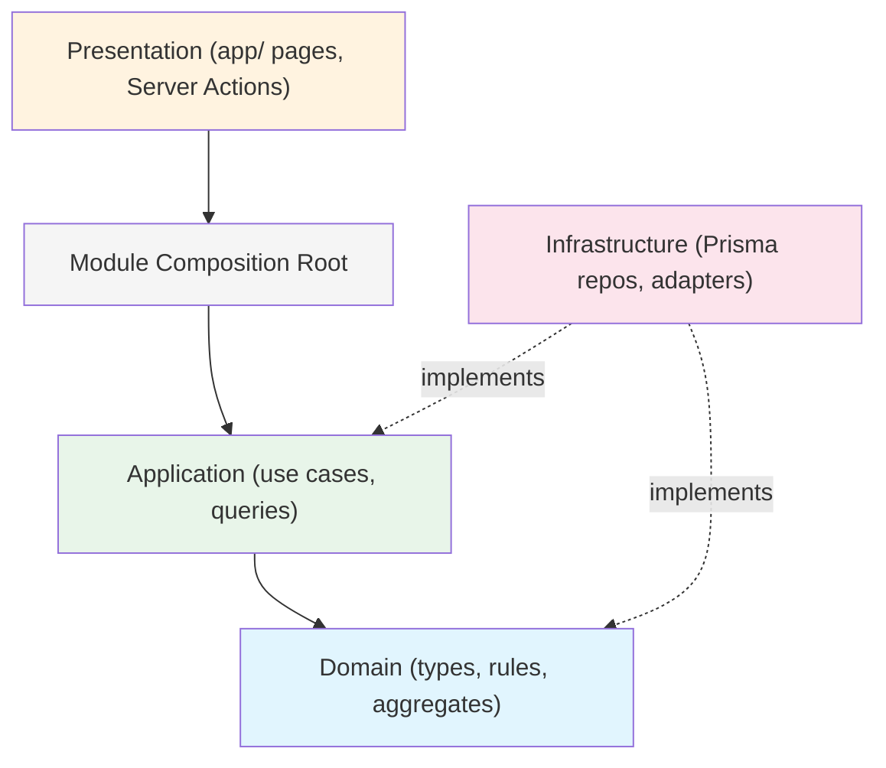
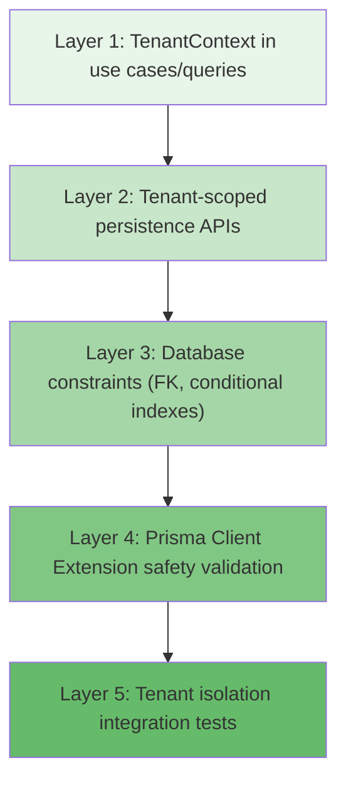

# Iteración 2 — ATS Architecture Decision Review

**Fecha:** 2026-09-01 (Iteración 2) · 2026-09-01 (Iteración 2.1) · 2026-09-01 (Iteración 2.2)
**Estado:** Iteración 2 + 2.1 + 2.2 consolidada. Architecture decisions approved for Target Architecture (Iteración 3).
**Baseline:** [domain_and_product_redesign_1_1_1.md](file:///c:/Users/brand/Documents/Proyectos%20de%20programaci%C3%B3n/AMA%20Hospital/ats-app/docs/product/domain_and_product_redesign_1_1_1.md) (Iteración 1 + 1.1 consolidada)

---

## 1. Executive Recommendation

The architecture translates the approved domain model into a **3-module Modular Monolith** with strict dependency direction, explicit `tenantId` on all tenant-owned tables, a 5-layer tenant enforcement strategy that **fails closed**, plain-function use cases with actor-appropriate contexts, lightweight CQRS, synchronous in-process domain events dispatched post-commit, transactional audit for critical operations, and policy-function authorization with tenant-scoped roles.

The system treats tenant isolation as a **critical security invariant** enforced at every layer. A missing tenant scope blocks the operation unconditionally — it never degrades to a warning.

---

## 2. Architecture Principles

1. **Tenant isolation is a system invariant** that fails closed. A missing tenant scope is a security failure, not a warning.
2. **Domain code has zero infrastructure dependencies.** No Prisma imports. No Better Auth imports. No Next.js imports.
3. **Modules own their data.** No module reaches into another module's repository or infrastructure.
4. **Make the common case simple.** CRUD entities don't need aggregates. Read screens don't need repositories.
5. **One way to do each thing.** One use case pattern. One error pattern. One repository pattern.
6. **Infrastructure is replaceable.** Better Auth, Prisma, S3, Resend — all behind ports.
7. **Test what matters.** Tenant isolation, domain invariants, authorization policies. Not pass-through mappers.
8. **Application layer defines transactional boundaries.** Infrastructure executes them.
9. **Public and authenticated contexts are explicitly distinct.** Guest Application and Recruiter Application are separate use cases.
10. **Audit and Domain Events serve different purposes.** Audit records compliance facts transactionally; domain events trigger post-commit side effects.
11. **Server-only infrastructure must have explicit server-only boundaries** so it never accidentally enters client bundles.
12. **Target architecture is chosen for correctness and maintainability.** Existing experimental folder structures do not constrain the target.

---

## 3. Module Boundary Decision (Decision A)

| Decision | Option A: 5 modules | Option B: 3 modules | Option C: 2 modules | Recommendation | Rationale | MVP Cost | Future Impact |
| :--- | :--- | :--- | :--- | :--- | :--- | :--- | :--- |
| Module count | identity, organization, recruiting, privacy, careers | identity, organization, recruiting | identity, recruiting | **Option B: 3 modules** | Privacy is tightly coupled to Candidate/Application lifecycle. Careers is a thin presentation layer over Recruiting data. Separating them adds indirection without reducing coupling. | Low | Low risk. Privacy/Careers can be extracted later if needed. |

### Final Module Structure

```text
src/modules/
  identity/          # Authentication infrastructure
  organization/      # Tenancy, org structure, roles & permissions
  recruiting/        # Core ATS: candidates, vacancies, applications, pipelines, privacy, catalogs
```

### Module Ownership

| Module | Owns | Does NOT Own |
| :--- | :--- | :--- |
| **identity** | User, Session, Account, Verification (Better Auth managed tables) | Anything recruiting or tenant-specific |
| **organization** | Tenant, LegalEntity, Location, Department, TenantMembership, Role, Permission, MembershipRole, RolePermission | Vacancy, Candidate, Application, Catalogs |
| **recruiting** | Candidate, Vacancy, VacancyLocation, Application, HiringPipeline, PipelineVersion, PipelineStage, ApplicationStageHistory, Interview, HiringTeamMember, ApplicationSource, RejectionReason, DataProvenance, PrivacyAcknowledgment, PrivacyPolicyVersion | User, Tenant, TenantMembership |

---

## 4. Dependency Rules & Port Ownership (Decision B)

### Layer Direction (Within Each Module)



> [!IMPORTANT]
> **Correction 2.2:** The Dependency Inversion principle dictates that **inner/application layers define abstractions (Ports), and outer/infrastructure layers implement them (Adapters)**. Infrastructure directories contain implementations, NOT the contracts themselves.

### Import Rules

```text
✅ app/       → modules/*/public.ts or public.server.ts
✅ app/       → shared/types/
✅ application/ → domain/
✅ application/ → shared/types/
✅ infrastructure/ → domain/ (to implement ports)
✅ infrastructure/ → application/ (to implement ports)
✅ infrastructure/ → shared/types/
❌ app/       → modules/*/infrastructure/ (never directly)
❌ app/       → modules/*/domain/ (never directly)
❌ domain/    → application/
❌ domain/    → infrastructure/
❌ domain/    → app/
❌ domain/    → generated/prisma/
❌ application/ → infrastructure/
```

### Port Placement Rule

Ports must NOT be placed in a generic global dumping ground.
*   **Module-owned ports:** If only one module owns the requirement (e.g., `FileStoragePort` owned by Recruiting), the port belongs in that module's application layer.
*   **Platform cross-cutting ports:** If multiple independent modules require a capability (e.g., `AuditPort`, `TransactionPort`), it belongs in a shared platform/application abstraction.

---

## 5. TenantContext (Decision C)

### Shape

```typescript
// shared/types/tenant-context.ts

/** Cross-cutting tenant isolation context. Minimal. */
type TenantContext = {
  readonly tenantId: string;
};

/** For authenticated internal workforce actors. */
type AuthenticatedContext = TenantContext & {
  readonly userId: string;
  readonly membershipId: string;
  readonly permissions: readonly string[];
};

/** For public unauthenticated tenant-scoped operations (Guest Apply). */
type PublicTenantContext = TenantContext;
```

### Rules

1. **TenantContext is never constructed from client-supplied tenantId in authenticated flows.** Always derived from authenticated membership.
2. **In public flows, tenantId is derived from a validated tenant slug lookup.** TenantResolver verifies slug exists and tenant is active.
3. **Use cases receive the appropriate context type as their first parameter.** They never resolve it themselves.
4. **Repositories require `tenantId` for all tenant-owned operations.** No default/global queries.

---

## 6. Multi-Tenant Enforcement (Decision D)

### 5-Layer Defense-in-Depth Strategy

> [!CAUTION]
> **Correction 2.2:** The Prisma Client Extension is a **defense-in-depth safety mechanism, not the sole tenant isolation guarantee**. No security architecture assumes an extension intercepts every possible nested/raw operation flawlessly without complementary testing.



*   **Layer 1:** Every tenant-owned use case requires an already-resolved `TenantContext`.
*   **Layer 2:** Every persistence API explicitly filters by `tenantId`.
*   **Layer 3:** Database constraints (FKs, indexes) ensure structural safety.
*   **Layer 4:** Prisma Client Extension statically intercepts model queries and throws `TenantIsolationError` if `tenantId` is missing, **failing closed**.
*   **Layer 5:** Dedicated integration tests verify that cross-tenant operations fail.

### Raw SQL Policy (Decision AJ)

Because tenant isolation is critical, tenant-owned operations must NOT use arbitrary `$queryRaw` or `$executeRaw` outside explicitly reviewed persistence infrastructure. Any future raw SQL must:
1. Receive `TenantContext`.
2. Include explicit tenant isolation.
3. Be covered by tenant-isolation tests.

---

## 7. Tenant Ownership in Database (Decision E)

| Decision | Option A: Explicit tenantId everywhere | Option B: Infer via parent FK | Recommendation | Rationale |
| :--- | :--- | :--- | :--- | :--- |
| Tenant column strategy | Every tenant-owned table has `tenantId` column | Derive tenant through joins | **Option A: Explicit tenantId everywhere** | Inference requires JOINs for every isolation check. Denormalized tenantId enables simple WHERE clauses. |

### Rule

Every table that stores tenant-specific business data gets an explicit `tenantId` column. Global product definitions (like Permissions) or identity (User/Session) do not.

---

## 8. Repository Strategy (Decision F)

| Decision | Option A: Repo per aggregate | Option B: Repo per entity | Option C: Repos only where justified | Recommendation | Rationale |
| :--- | :--- | :--- | :--- | :--- | :--- |
| Repository scope | ApplicationRepo, PipelineVersionRepo | One repo per DB table | Repos for aggregates + complex writes; query functions for reads | **Option C** | Avoids GenericRepository anti-pattern. CRUD entities don't need repositories. |

### Concrete Plan

*   **Full Repositories:** For aggregates (`IApplicationRepository`, `IPipelineVersionRepository`).
*   **Lightweight Write Functions:** For simple creates/updates (e.g. `createVacancy()`).

---

## 9. Command/Query Strategy & Projection Boundary (Decision G)

> [!IMPORTANT]
> **Correction 2.2:** To preserve dependency inversion, read queries that use Prisma directly MUST be treated as **infrastructure read adapters**.

| Decision | Option A: Application defines query interfaces | Option B: Queries are infrastructure read adapters | Recommendation | Rationale |
| :--- | :--- | :--- | :--- | :--- |
| Read/write separation | `app` → `use case` → `query interface` → `infra` | `app` → `infra query adapter` | **Option B: Infrastructure Read Adapters** | Pragmatic lightweight CQRS. Avoids unnecessary repository interfaces for trivial reads. |

### Convention

```text
Write Path:
  Presentation → Use Case function (Application) → Repository Port → Infrastructure Adapter

Read Path:
  Presentation → Module Composition Root → Infrastructure Read Adapter → DTO
```

Query adapters bypass the Application and Domain layers internally, directly querying Prisma and returning plain DTOs. The Application layer remains strictly infrastructure-independent.

---

## 10. Use Case & Composition Root (Decision H)

| Decision | Option A: Classes | Option B: Plain functions | Option C: Service objects | Recommendation | Rationale |
| :--- | :--- | :--- | :--- | :--- | :--- |
| Use case style | `class SubmitApplicationUseCase { execute() }` | `async function submitApplication(ctx, input, deps)` | `ApplicationService.submit()` | **Option B: Plain async functions** | Low ceremony, testable, AI-friendly, idiomatic TypeScript. |

### Composition Root Boundary

> [!IMPORTANT]
> **Correction 2.2:** The composition root is the **ONLY** place where application abstractions and infrastructure implementations are wired together.

`app/` does NOT import `modules/*/infrastructure/` directly. Server Actions call a composition root entry point. Whether this root lives in `modules/*/composition.server.ts` or a centralized `src/composition/` directory is deferred to Iteration 3.

---

## 11. Aggregate Strategy (Decision I)

| Entity | Aggregate Root? | Rationale |
| :--- | :--- | :--- |
| **Application** | ✅ Yes | Multiple invariants: stage must belong to vacancy's pipeline version, outcome transitions follow rules, stage changes are atomic with history. |
| **PipelineVersion** | ✅ Yes | Structural integrity: stages must have unique order, published versions are immutable, must have exactly one initial stage. |
| **Vacancy** | ⚠️ Light | Lifecycle transitions are simple enum checks. Handle in use case. |

---

## 12. Transaction Boundaries (Decision J)

> [!IMPORTANT]
> **Correction 2.2:** Prisma-specific transaction types (like `Prisma.TransactionClient`) must NEVER cross the infrastructure boundary.

### Transaction Ownership Rule

*   **Application defines WHAT must be atomic.**
*   **Infrastructure defines HOW it is atomic.**

The `TransactionPort` must use an application-owned abstraction. The exact implementation shape (e.g. Unit of Work exposing ports, transaction-scoped dependency set, or infrastructure coordinator callback) will be chosen in Iteration 3 based on Prisma API verification.

No repository illegally owns unrelated aggregates. The application orchestrates cross-aggregate operations without leaking Prisma types inward.

---

## 13. Domain Event Strategy (Decision K)

| Decision | Option A: Sync dispatcher | Option B: Aggregate event collector | Option C: Outbox | Option D: No events yet | Recommendation | Rationale |
| :--- | :--- | :--- | :--- | :--- | :--- | :--- |
| Event infrastructure | In-process synchronous publish | Aggregate.pullEvents() → dispatch | Outbox table + polling | Explicit orchestration | **Option A: Synchronous in-process dispatcher** | Simple. Testable. Sufficient for MVP. |

Domain events are dispatched ONLY after successful transaction commit. They do not provide durable delivery guarantees for the MVP.

---

## 14. Audit Strategy (Decision L)

Audit is split into two categories:
1.  **Transactional Audit:** Critical state changes are written in the same DB transaction as the business mutation.
2.  **Post-Commit Side Effects:** Non-critical reactions (like emails) are dispatched after commit.

`AuditPort` is a cross-cutting platform application abstraction. Its implementation (`PrismaAuditAdapter`) lives in `infrastructure/audit`.

---

## 15. Authorization Architecture (Decision M)

Authorization uses plain policy functions (`canMoveApplicationStage(actor, resource)`) checked at the use case entry point.

---

## 16. Roles & Permissions Architecture (Decision N)

Roles are tenant-scoped from day one. Permissions are global product definitions. Standard system roles (TenantAdmin, Recruiter) are seeded on tenant creation.

---

## 17. Better Auth Boundary (Decision O)

Application code uses a `CurrentActor` abstraction. A thin adapter in the identity infrastructure converts the Better Auth session into a `CurrentActor`.

---

## 18. Next.js Integration (Decision P)

> [!IMPORTANT]
> **Correction 2.2:** `src/app/` is a delivery mechanism, not a domain architecture. It orchestrates UI, pages, and route handlers. It does NOT own business rules, repositories, or Prisma operations.

*   **Server Actions:** Validate input (Zod), resolve context, call composition root. Contain no business logic. Location (route-local vs centralized `app/actions/`) is deferred to Iteration 3.
*   **Route Handlers:** Handle public webhooks or guest endpoints.
*   **Server Components:** Call query adapters via composition root.

---

## 19. Validation Strategy (Decision Q)

Zod at boundary, domain rules in domain, DB for structural integrity.

---

## 20. Error Strategy (Decision R)

Authorization errors (Forbidden, Unauthenticated) and NotFound are treated as **expected application failures** returned via `Result<T, E>`. Cross-tenant resource access returns `NotFound`, preventing enumeration attacks. Only unexpected infrastructure failures `throw`.

---

## 21. CV/File Storage & Email Boundaries (Decision T & U)

*   **Application Boundary:** Defines `FileStoragePort` and `EmailPort`.
*   **Infrastructure Layer:** Implements adapters (e.g. `ObjectStorageAdapter`, `ResendAdapter`).
*   Email sending is post-commit best-effort and NEVER inside a database transaction.
*   CVs are stored using a stable `storageKey`. Access is via short-lived signed URLs.

---

## 22. Cross-Module Communication (Decision Y)

Modules communicate via direct import of their public interfaces. No module imports another module's infrastructure or domain directly.

---

## 23. Shared Kernel & Platform Core (Decision Z)

*   `shared/` is strictly for pure domain-agnostic types used by multiple modules (`Result<T, E>`, `TenantContext`).
*   Cross-cutting platform contracts (like `AuditPort`, `TransactionPort`) belong to a platform application layer.
*   Implementations of these ports live in `src/infrastructure`.

---

## 24. Domain Types vs Persistence Types (Decision AK)

> [!IMPORTANT]
> **Correction 2.2:** Do NOT mechanically duplicate every Prisma type in the Domain layer.

Independent domain types (entities, aggregates) are created ONLY when:
*   Business invariants exist.
*   Persistence representation differs materially.
*   Value semantics matter.

Simple read DTOs and configuration CRUD do not need ceremonial domain entity wrappers. Entity IDs (e.g. `TenantId`) remain plain strings unless branded types materially improve safety.

---

## 25. Structural Freedom & Experimental Code (Decision AL)

> [!CAUTION]
> **Correction 2.2:** The existing experimental repository layout, folder names, and module boundaries are NOT constraints for the Target Architecture.

The repository's historical code is valuable for understanding existing functionality, but Iteration 3 is explicitly authorized to redefine the folder hierarchy, module boundaries, composition roots, and naming conventions to achieve clear boundaries and pragmatic Next.js structure.

**Existing experimental code does not veto a better target architecture.**

---

## 26. Architecture Decision Matrix

| # | Decision | Recommendation | Status | MVP Cost | Future Impact |
| :--- | :--- | :--- | :--- | :--- | :--- |
| A | Module boundaries | 3 modules: identity, organization, recruiting | ✅ RESOLVED | Low | Low risk |
| B | Dependency direction | Strict layering; app → composition root → application → domain | ✅ RESOLVED | Low | Foundation |
| C | TenantContext | Minimal isolation context; branding is a separate read model | ✅ RESOLVED | Low | Extensible |
| D | Tenant enforcement | 5-layer defense-in-depth, fails closed | ✅ RESOLVED | Medium | Evolvable to RLS |
| E | Tenant ownership | Explicit tenantId on all tenant-owned tables | ✅ RESOLVED | Low | Safety |
| F | Repository strategy | Repos for aggregates; lightweight query adapters for reads | ✅ RESOLVED | Low | Focused |
| G | CQRS | Read models as infra adapters exposed via composition root | ✅ RESOLVED | Low | No framework |
| H | Use case convention | Plain async functions; actor-appropriate contexts | ✅ RESOLVED | Low | Testable |
| I | Aggregate strategy | Application + PipelineVersion as rich aggregates | ✅ RESOLVED | Low | Focused |
| J | Transaction boundaries | Application layer defines scope, infrastructure executes. No Prisma types leak inward. | ✅ RESOLVED | Medium | Clear |
| K | Domain events | Synchronous post-commit dispatcher; no durable delivery guarantee | ✅ RESOLVED | Low | Evolvable |
| L | Audit | Transactional audit for critical ops; AuditPort as cross-cutting contract | ✅ RESOLVED | Medium | Comprehensive |
| M | Authorization | Policy functions at use case entry | ✅ RESOLVED | Low | Composable |
| N | Roles & Permissions | Global permissions, tenant-scoped roles with system templates | ✅ RESOLVED | Low | Future-safe |
| O | Better Auth boundary | CurrentActor abstraction | ✅ RESOLVED | Low | Replaceable |
| P | Next.js integration | App Router is delivery layer, not domain architecture | ✅ RESOLVED | Low | Idiomatic |
| Q | Validation | Zod at boundary, domain rules in domain, DB for structural | ✅ RESOLVED | Low | Clear |
| R | Error handling | Result for expected failures; throw for unexpected | ✅ RESOLVED | Low | Consistent |
| S | Read models | DTO returns, mandatory tenantId | ✅ RESOLVED | Low | Performant |
| T | File storage | Application port; signed URLs on-demand | ✅ RESOLVED | Low | Secure |
| U | Email | Application port; post-commit best-effort; never in transaction | ✅ RESOLVED | Low | Vendor-free |
| W | App duplicate rule | Application check + conditional partial unique index | ✅ RESOLVED | Low | Safe |
| X | Vacancy lifecycle | Enum + policy functions | ✅ RESOLVED | Low | Simple |
| Y | Cross-module comm | Direct import of public module interface | ✅ RESOLVED | Low | Type-safe |
| Z | Shared kernel | Minimal types only. Infrastructure implementations isolated. | ✅ RESOLVED | Low | No bloat |
| AJ | Raw SQL Policy | Restricted to reviewed persistence adapters with TenantContext | ✅ RESOLVED | Low | Secure |
| AK | Domain Types | Selective DDD. No mechanical duplication of Prisma types. | ✅ RESOLVED | Low | Pragmatic |
| AL | Structural Freedom | Experimental code does not constrain Target Architecture. | ✅ RESOLVED | Low | Unblocks It.3 |
| AI | Prisma version | Must verify API compatibility before implementation | ⏳ DEFERRED to It.3 | — | Critical |

---

## 27. Architecture Rules

```text
RULE-001  Domain/Application code never imports Prisma (generated/prisma) or src/infrastructure.
RULE-002  Domain code never imports Better Auth.
RULE-003  Domain code never imports Next.js (next/*).
RULE-004  Server Actions contain no business logic. They validate, resolve context, and call composition root.
RULE-005  All tenant-owned queries require a resolved tenantId. No default/global queries.
RULE-006  Modules never import from another module's infrastructure/ or domain/ directly.
RULE-007  Modules communicate only through their public interface (public.ts / public.server.ts).
RULE-008  Read models must always include tenantId filtering.
RULE-009  Better Auth types do not cross the identity adapter boundary.
RULE-010  No `any` types in domain or application layers. Use `unknown` and narrow.
RULE-011  One use case convention: plain async functions with actor-appropriate context.
RULE-012  Expected application failures use Result<T, E>. Unexpected infrastructure errors throw.
RULE-013  Authorization is checked at use case entry, not scattered in Server Actions or deep in domain.
RULE-014  Cross-aggregate transaction boundaries are defined by the application use case and executed by infrastructure.
RULE-015  Audit records are append-only and tenant-scoped.
RULE-016  No circular dependencies between modules.
RULE-017  No tenant-specific code paths (if tenant === "AMA").
RULE-018  Zod schemas live in application layer, not domain.
RULE-019  Query adapters return DTOs, not Prisma model types.
RULE-020  File storage uses a port abstraction; domain never references S3/R2/etc.
RULE-021  Email sending uses a port abstraction; domain never references Resend/SendGrid/etc.
RULE-022  Every table with tenant-owned data has an explicit tenantId column.
RULE-023  Cross-tenant FK integrity is enforced at application layer.
RULE-024  Published PipelineVersions are structurally immutable.
RULE-025  Application duplicate prevention has application-level UX check plus database concurrency protection.
RULE-026  Domain events are dispatched only after successful transaction commit.
RULE-027  Only shared/ types used by 2+ modules belong in shared/. No infrastructure ports.
RULE-028  No empty ceremonial directories. Only create folders that contain content.
RULE-029  Test files co-locate with the code they test or live in a parallel __tests__/ directory within the module.
RULE-030  Tenant isolation violations fail closed in every environment. No warning mode.
RULE-031  No tenant-owned persistence operation executes without TenantContext.
RULE-032  Critical audit facts are persisted transactionally with the business operation.
RULE-033  Post-commit domain events do not provide durable delivery guarantees.
RULE-034  Public and authenticated use cases use actor-appropriate context types.
RULE-035  Tenant-scoped resources from another tenant are treated as non-existent (NotFound), never Forbidden.
RULE-036  Permission definitions are global product capabilities; tenant roles are evaluated independently.
RULE-037  Recruiting catalogs belong to Recruiting module even when tenant-configurable.
RULE-038  Shared kernel may not become a generic dumping ground.
RULE-039  Prisma-specific mechanisms must be validated against the actual project Prisma version before implementation.
RULE-040  Email delivery must never hold open a database transaction.
RULE-041  App/ never imports modules/*/infrastructure/ or modules/*/domain/ directly. Only composition roots.
RULE-042  Ports are defined by the consuming inner layer; infrastructure implements them.
RULE-043  Prisma-specific types, including transaction clients, never cross the infrastructure boundary.
RULE-044  Prisma Client Extensions are defense-in-depth safety mechanisms, not the sole tenant isolation mechanism.
RULE-045  No security invariant assumes all nested/raw Prisma operations are intercepted by a Client Extension.
RULE-046  Raw SQL against tenant-owned data is restricted to reviewed persistence infrastructure and requires explicit TenantContext.
RULE-047  Composition roots are the only locations that wire application ports to infrastructure adapters.
RULE-048  Server-only infrastructure must never enter client bundles.
RULE-049  Next.js App Router is a delivery layer, not a domain/module ownership model.
RULE-050  Read architecture must preserve dependency inversion; Prisma read projections cannot silently make application layer infrastructure-dependent.
RULE-051  Existing repository structure is historical/experimental and does not constrain Target Architecture.
RULE-052  Target Architecture is chosen for correctness and maintainability, then migrated incrementally.
```

---

## 28. Decisions Deferred to Iteration 3

| Decision | Why Deferred |
| :--- | :--- |
| **Exact folder structure & composition root location** | Iteration 3 will define the ideal layout for the Next.js Modular Monolith. |
| **Concrete Prisma schema design** | Requires Iteration 3 evaluation of current Prisma constraints. |
| **Prisma Client Extension implementation** | Needs schema + version verification for raw/nested behaviors. |
| **TransactionCoordinator implementation** | Depends on Prisma `$transaction` API shape verification. |
| **Server Action placement** | Will evaluate cohesion and Next.js conventions. |
| **Server-only boundaries** | Implementation mechanism (e.g., `server-only` imports) to be decided. |

---

## 29. Readiness Assessment

All foundational architectural decisions (A through AL) have been analyzed and corrected (including Dependency Inversion, Transaction Abstraction, Tenant Safety Net, and Structural Freedom). The project is ready for:

```text
ITERACIÓN 3 — Target Architecture
```
