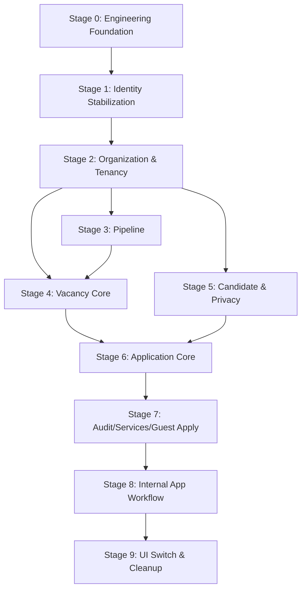

# Iteration 6.2 — Implementation Plan

**Date:** 2026-09-01
**Status:** APPROVED FOR EXECUTION — ITERATION 7+

This document defines the executable migration and implementation plan to move the experimental AMA ATS repository to the frozen **Target Architecture** (Modular Monolith). 

## 1. Executive Summary

This plan outlines an incremental, vertical-slice-oriented migration. It strictly preserves working value, explicitly defines schema changes, requires tenant-isolation security gates at each data-touching stage, and builds deep structural capabilities (Audit, Privacy, Transactions, Events) precisely before the Guest Apply slice depends on them.

## 2. Current Repository State vs Target

*   **Runtime Dependencies**: `@prisma/adapter-pg` and `pg` are in `dependencies`.
*   **Prisma Generator**: Uses `provider = "prisma-client"` with explicit output. KEEP.
*   **Tests**: Vitest configured and operational. Playwright deferred until Guest Apply E2E.
*   **Models**: Experimental schemas exist.
*   **Legacy Structure**: Code lives in `src/domain/`, `src/application/`, `src/infrastructure/`. Target is exactly three principal modules: `identity`, `organization`, and `recruiting`.
*   **Auth**: Better Auth is already integrated. Do not rebuild, stabilize inside Identity.

## 3. Preflight Technical Decisions

*   **Testing Framework**: Vitest. 
*   **Test Database Strategy**: Fast adapter/logic tests may use lightweight data. Migration/security integration tests must use an actual clean PostgreSQL DB matching the production migration schema (not `db:push`).
*   **Result Pattern**: A simple discriminated union `Result<T,E>` defined in `platform/shared`.
*   **ESLint Architecture Enforcement**: Staged boundaries targeting `src/modules/identity/**`, `src/modules/organization/**`, `src/modules/recruiting/**` and `src/platform/**` first.
*   **PartialIndexes Spike**: Moved to Stage 0 for pure technology capability validation.
*   **Server-Only**: Convention defined, targeting staged static enforcement for new code.

## 4. Migration Dependency Graph

## 5. Current → Target File Mapping

| Current | Target | Stage | Action | Removal Task |
| :--- | :--- | :--- | :--- | :--- |
| `src/domain/*` | `src/modules/recruiting/`, `src/modules/organization/` | 1-8 | REWRITE / MOVE | I6-S9-T04 |
| `src/application/*` | `src/modules/recruiting/`, `src/modules/organization/` | 1-8 | REWRITE / MOVE | I6-S9-T04 |
| `src/infrastructure/prisma/*` | `src/modules/*/infrastructure/` | 1-8 | REWRITE / MOVE | I6-S9-T04 |
| `src/app/(public)/jobs` | `src/app/(public)/[tenantSlug]/jobs` | 7 | REWRITE | I6-S9-T01 |
| `src/app/(protected)/*` | `src/app/(protected)/[tenantSlug]/*` | 9 | REWRITE | I6-S9-T01 |

## 6. Prisma Migration Matrix

| Current Model | Target Model | Strategy | Add/Backfill/Verify/Switch/Drop | Stage | Risk | Data Inspection? |
| :--- | :--- | :--- | :--- | :--- | :--- | :--- |
| `User`, `Session`, `Account`, `Verification` | (Same) | KEEP | N/A (Stabilize boundaries only) | 1 | HIGH | No |
| `Organization` | `Tenant`, `LegalEntity` | REWRITE | ADD Tenant → BACKFILL (Inspect) → VERIFY → SWITCH → DROP in S9 | 2 | CRITICAL | YES |
| `HiringPipeline`, `PipelineStage` | `HiringPipeline`, `PipelineVersion`, `PipelineStage` | REWRITE | ADD PipelineVersion → BACKFILL (Inspect) → VERIFY → SWITCH | 3 | MEDIUM | YES |
| `JobPosting` | `Vacancy` | REWRITE | ADD Vacancy → BACKFILL from JobPosting → VERIFY → SWITCH → DROP JobPosting in S9 | 4 | HIGH | YES |
| `Candidate` | `Candidate` | MODIFY | ADD fields → BACKFILL → VERIFY | 5 | HIGH | NO |
| `CandidateLead` | None | DELETE | INSPECT → STOP USAGE → VERIFY ZERO LIVE → DROP in S9 | 5/9 | MEDIUM | YES |
| `Application` | `Application`, `ApplicationStageHistory` | REWRITE | ADD fields → BACKFILL → VERIFY DUPES → SWITCH | 6 | HIGH | YES |

---

## 7. Stage Details & Task Registry

### Stage 0: Engineering Foundation
**Objective:** Unblock safe execution with tests, types, and tool validations.
**Why Now:** Required to enforce architecture boundaries and validate basic logic.
**Prerequisites:** None.
**Exit Criteria:** Vitest test suite runs, architectural imports are restricted on new modules, and the team knows if partial indexes are supported in Prisma.

**Task ID:** I6-S0-T01
**Title:** Move @prisma/adapter-pg and pg to runtime dependencies
**Risk:** LOW
**Depends On:** None
**Blocks:** I6-S0-T02
**Can Run In Parallel With:** None
**Files / Areas:** `package.json`
**Objective:** Ensure Prisma initializes securely on Edge/Server with native PG driver.
**Acceptance Criteria:**
- `package.json` dependencies include `@prisma/adapter-pg` and `pg`.
**Validation:** `pnpm install`, `pnpm validate`

**Task ID:** I6-S0-T02
**Title:** Setup Vitest and canonical test scripts
**Risk:** LOW
**Depends On:** I6-S0-T01
**Blocks:** I6-S0-T04
**Can Run In Parallel With:** I6-S0-T03, I6-S0-T05
**Files / Areas:** `vitest.config.mts`, `package.json`
**Objective:** Provide the unit and fast integration testing framework.
**Acceptance Criteria:**
- Vitest is configured.
- `package.json` has `pnpm test` and `pnpm test:integration`.
**Validation:** `pnpm test`

**Task ID:** I6-S0-T03
**Title:** Add ESLint no-restricted-imports rules for target modules
**Risk:** LOW
**Depends On:** I6-S0-T01
**Blocks:** Future module implementations
**Can Run In Parallel With:** I6-S0-T02, I6-S0-T04
**Files / Areas:** `eslint.config.mjs`
**Objective:** Guard boundaries dynamically for the exact three target modules (`identity`, `organization`, `recruiting`) and `platform`.
**Acceptance Criteria:**
- Modules cannot cross-import Domain/Infra directly.
- The three principal modules enforce `public.ts` / `public.server.ts` boundaries.
**Validation:** `pnpm lint`

**Task ID:** I6-S0-T04
**Title:** Define canonical Result<T,E> discriminated union
**Risk:** LOW
**Depends On:** None
**Blocks:** I6-S1-T01
**Can Run In Parallel With:** I6-S0-T05, I6-S0-T06
**Files / Areas:** `src/platform/shared/result.ts`
**Objective:** A unified, lightweight error handling primitive for domain logic.
**Acceptance Criteria:**
- `Result<T, E>` type defined as `{ ok: true, value: T } | { ok: false, error: E }`.
**Validation:** `pnpm validate`

**Task ID:** I6-S0-T05
**Title:** Define Zod env validation
**Risk:** LOW
**Depends On:** None
**Blocks:** None
**Can Run In Parallel With:** I6-S0-T04, I6-S0-T06
**Files / Areas:** `src/config/env.server.ts`
**Objective:** Ensure critical environment variables exist at boot.
**Acceptance Criteria:**
- Zod schema for `DATABASE_URL` and `NODE_ENV`.
**Validation:** `pnpm validate`

**Task ID:** I6-S0-T06
**Title:** Prisma PartialIndexes Spike (Technology Validation)
**Risk:** LOW
**Depends On:** None
**Blocks:** I6-S6-T03
**Can Run In Parallel With:** Stage 1, Stage 2
**Files / Areas:** Scratch/Local DB
**Objective:** Validate that Prisma 7.6 can emit the correct partial unique constraint SQL for PostgreSQL.
**Acceptance Criteria:**
- Spike confirms `previewFeatures = ["partialIndexes"]` is SUPPORTED (Empirically verified in Prisma 7.6.0).
- Preferred syntax for I6-S6-T03: `@@unique([tenantId, candidateId, vacancyId], where: { outcome: "NONE" })` (string literal for enum predicate).
- Generates PostgreSQL: `CREATE UNIQUE INDEX ... WHERE ("outcome" = 'NONE');`.
- Production schema remains untouched.
**Validation:** Inspection of generated SQL (SUPPORTED).

---

### Stage 1: Identity Framework Stabilization
**Objective:** Stabilize Better Auth boundaries and current actor context.
**Why Now:** Identity is required before tenant-membership can exist.
**Prerequisites:** Stage 0.
**Exit Criteria:** `CurrentActor` can be resolved consistently across server contexts without Better Auth leaking into domain logic.

**Task ID:** I6-S1-T01
**Title:** Stabilize Better Auth integration & isolate boundary
**Risk:** HIGH
**Depends On:** I6-S0-T04
**Blocks:** I6-S1-T02
**Can Run In Parallel With:** I6-S0-T05
**Files / Areas:** `src/modules/identity/`
**Objective:** Secure Better Auth behind the Identity module boundary.
**Acceptance Criteria:**
- Identity module `public.server.ts` exposes strict auth capabilities.
- No schema mutation unless strictly required by Better Auth.
**Validation:** `pnpm validate`, `pnpm db:validate`

**Task ID:** I6-S1-T02
**Title:** Implement CurrentActor resolution
**Risk:** MEDIUM
**Depends On:** I6-S1-T01
**Blocks:** I6-S2-T04
**Can Run In Parallel With:** I6-S2-T01
**Files / Areas:** `src/modules/identity/`
**Objective:** Resolve authenticated user.
**Acceptance Criteria:**
- `resolveCurrentActor()` returns a non-framework domain `Actor` type.
**Validation:** `pnpm test:integration`

---

### Stage 2: Organization Persistence & Tenancy Foundation
**Objective:** Core tenant persistence and authorization models.
**Why Now:** All business data depends on a valid `tenantId`.
**Prerequisites:** Stage 1.
**Exit Criteria:** `TenantContext` safely provided to server functions. AMA seed exists.

**Task ID:** I6-S2-T01
**Title:** ADD Organization Persistence Schema (Tenant, LegalEntity, Location, Department)
**Status:** COMPLETED
**Risk:** HIGH
**Depends On:** None
**Blocks:** I6-S2-T02
**Can Run In Parallel With:** I6-S1-T01
**Files / Areas:** `prisma/schema.prisma`, `prisma/migrations/0001_baseline/`
**Objective:** Create the foundational B2B structures.
**Acceptance Criteria:**
- `Tenant`, `LegalEntity`, `Location`, `Department` added. Tenant, LegalEntity, Location, and tenant-scoped Department foundation established. Persistence history was subsequently consolidated during I6-S2-T02 into the canonical pre-production `0001_baseline`.
**Validation:** `pnpm db:validate` (Valid), `pnpm db:migrate:status` (Up to date via `0001_baseline`), `pnpm test` (17 passed).

**Task ID:** I6-S2-T02
**Title:** BACKFILL Organization Data & Harden Department Tenancy (Dev Cleanup & Migration Squash)
**Status:** DONE / VERIFIED
**Risk:** CRITICAL
**Depends On:** I6-S2-T01
**Blocks:** I6-S2-T03
**Can Run In Parallel With:** None
**Files / Areas:** `prisma/schema.prisma`, `prisma/migrations/0001_baseline/`, `prisma/seed.ts`, `src/application/job-posting/**`, `src/interfaces/http/actions/job.actions.ts`, `src/app/api/jobs/**`
**Objective:** Migrate legacy organizational data, remove obsolete prototype Branch models, decouple Organization, and squash migrations into a clean baseline.
**Acceptance Criteria:**
- Early removal of prototype `Branch` and `JobPostingBranch`: Removed from `schema.prisma`, `seed.ts`, and legacy queries/actions without regressing compilation.
- Squashed migration history: Replaced prototype migration chain (`0_init`, `20260902160000_...`, `20260902183000_...`) with a single canonical baseline `0001_baseline` generated directly from EMPTY → current schema.
- Decoupled `Organization` fixture: Independent deterministic legacy ID (`00000000-0000-4000-8000-000000000001`), completely decoupled from `Tenant.id`.
- Department hardening: Tenant-scoped slug unique (`@@unique([tenantId, slug])`), tenant-scoped name unique (`@@unique([tenantId, name])`), required `tenantId` (`NOT NULL`), and removal of unused `parentId` hierarchy.
- Development database reset: Recreated `public` schema in dev DB (`ats_db_dev`), deployed `0001_baseline`, and seeded canonical AMA Tenant, LegalEntities, Locations, and 10 flat departments.
- Invariants & tenant isolation verified: Same-tenant duplicate Department slug rejected; cross-tenant same Department slug allowed; cross-tenant LegalEntity/Location compound FK rejected.
- Migration reproducibility verified: Applied `0001_baseline` to empty isolated test schema; `prisma migrate diff` returned zero diff.
**Validation:** `pnpm db:validate` (Valid), `pnpm db:generate` (Valid), `pnpm db:migrate:status` (1 migration up to date), `pnpm test` (17 passed), `pnpm test:integration` (0 tests passed), `pnpm typecheck` (22 pre-existing errors, 0 regressions), `pnpm lint` (23 errors, 56 warnings, 0 regressions).

**Task ID:** I6-S2-T03
**Title:** Implement PublicTenantContext resolver
**Status:** DONE
**Risk:** MEDIUM
**Depends On:** I6-S2-T02
**Blocks:** I6-S7-T06
**Can Run In Parallel With:** I6-S2-T04
**Files / Areas:** `src/modules/organization/`
**Objective:** Resolve Tenant from public slug.
**Acceptance Criteria:**
- Contract implemented: `tenantSlug` → active `Tenant` → `PublicTenantContext`; missing or inactive tenant → `TENANT_NOT_FOUND` (fail-closed); empty slug → `INVALID_TENANT_SLUG`.
- Framework-independent `PublicTenantContext` (`tenantId`, `slug`, `name`).
- Consumer-owned port `PublicTenantReader` in `application/ports/` with zero Prisma leakage.
- Infrastructure adapter `PrismaPublicTenantReader` querying active tenant and projecting only required fields.
- Composition root wiring via `composition.server.ts`; public surface exported through `public.server.ts`; client-safe types in `public.ts`.
**Validation:** `pnpm test` (26 passed), `pnpm db:validate` (Valid), live DB verification.

**Task ID:** I6-S2-T04
**Title:** ADD Authorization Schema (Role, Permission, TenantMembership)
**Status:** DONE
**Risk:** HIGH
**Depends On:** I6-S2-T01
**Blocks:** I6-S2-T05
**Can Run In Parallel With:** I6-S2-T02
**Files / Areas:** `prisma/schema.prisma`, `prisma/migrations/0002_authorization_foundation/`, `prisma/seed.ts`, `src/application/auth/authorization.service.ts`
**Objective:** Create canonical membership and tenant-scoped RBAC persistence schema.
**Acceptance Criteria:**
- `Permission`: Global capabilities (`name @unique`, timestamped, no tenant leakage). Seeded 9 canonical capabilities deterministically.
- `Role`: Tenant-scoped (`tenantId`, `name`, `systemKey?`, `isSystem`, `@@unique([tenantId, name])`, `@@unique([tenantId, systemKey])`, `@@unique([tenantId, id])`). Seeded `TenantAdmin`, `Recruiter`, `HRManager` for AMA tenant.
- `TenantMembership`: Multi-tenant user membership (`tenantId`, `userId`, `status: TenantMembershipStatus`, `@@unique([tenantId, userId])`, `@@unique([tenantId, id])`).
- `MembershipRole`: Explicit join model with DB-enforced compound foreign keys (`[tenantId, tenantMembershipId] -> TenantMembership [tenantId, id]` and `[tenantId, roleId] -> Role [tenantId, id]`, `@@unique([tenantMembershipId, roleId])`).
- `RolePermission`: Many-to-many join model linking Role to global Permission.
- `UserRole`: Obsolete prototype model deleted; direct `User.roles` relation removed; legacy `AuthorizationService` made strictly tenant-scoped (requires explicit `tenantId`, queries single tenant membership, returns zero permissions/roles across tenants); blanket dev user membership bootstrap removed from `prisma/seed.ts`.
- Verified invariants: (1) Duplicate membership in same tenant rejected; (2) Same user across multiple tenants allowed; (3) Duplicate role in same tenant rejected; (4) Same system role across tenants allowed; (5) Cross-tenant MembershipRole assignment physically rejected by compound FK; (6) Global Permission shared across tenant roles allowed; (7) Cross-tenant permissions never unioned by `AuthorizationService`.
- Migration replay: Sequential migration chain `0001_baseline` → `0002_authorization_foundation` verified from empty PostgreSQL schema with zero diff.
**Validation:** `pnpm db:validate` (Valid), `pnpm db:generate` (Valid), `pnpm db:migrate:status` (2 migrations up to date), `pnpm test` (29 passed), `pnpm test:integration` (0 tests passed), `pnpm typecheck` (22 pre-existing errors, 0 regressions), `pnpm lint` (23 errors, 55 warnings, 0 regressions).

**Task ID:** I6-S2-T05
**Title:** Implement AuthenticatedContext resolver & Isolation Tests
**Status:** DONE / VERIFIED
**Risk:** HIGH
**Depends On:** I6-S1-T02, I6-S2-T04
**Blocks:** Stage 3, Stage 4
**Can Run In Parallel With:** None
**Files / Areas:** `src/modules/organization/application/authenticated-context.ts`, `src/modules/organization/application/ports/authenticated-membership-reader.ts`, `src/modules/organization/application/resolve-authenticated-context.ts`, `src/modules/organization/infrastructure/prisma-authenticated-membership-reader.ts`, `src/modules/organization/composition.server.ts`, `src/modules/organization/public.server.ts`, `src/modules/organization/public.ts`, `src/modules/organization/authenticated-context.test.ts`, `tests/integration/tenant-isolation.integration.test.ts`
**Objective:** Tie Actor to Tenant securely and establish authenticated tenant context boundary with strict tenant-scoped RBAC and isolation.
**Acceptance Criteria:**
- Canonical resolution chain:
  `CurrentActor + active Tenant + ACTIVE TenantMembership + tenant-scoped Roles + global Permissions → AuthenticatedContext`.
- Pure framework-independent `AuthenticatedContext` contract under Organization (`actor: { userId, email, name }`, `tenant: { tenantId, slug, name }`, `membership: { membershipId }`, `roles: readonly string[]`, `permissions: readonly string[]`).
- Fail-closed security semantics:
  `missing membership, cross-tenant membership, inactive membership, inactive tenant → NotFound` (identical error response to prevent leaking tenant existence across tenant boundaries).
- Role representation: `systemKey` preferred when present (e.g., `TENANT_ADMIN`, `RECRUITER`, `HR_MANAGER`), fallback to `role.name` for custom roles; deduplicated.
- Permission representation: global deduplicated capability strings (e.g., `tenant.manage`, `vacancy.create`).
- Consumer-owned port `AuthenticatedMembershipReader` (`findActiveForUserInTenant(userId, tenantId)`) with zero Prisma leakage.
- Infrastructure adapter `PrismaAuthenticatedMembershipReader` querying unique `[tenantId, userId]` with `status: ACTIVE` and projection of roles and permissions. Marked `import "server-only"`.
- Composition root wiring in `composition.server.ts`; public capability exported through `public.server.ts`; client-safe pure types exported from `public.ts`.
- Zero Prisma/Better Auth leakage through public surfaces. Identity module does not depend on Organization.
- Unit tests (12 tests) verifying success, unauthenticated, missing tenant, inactive tenant, missing membership, inactive membership, cross-tenant isolation, and boundary protection.
- Real PostgreSQL integration tests (9 tests) verifying live DB queries, same user in multiple tenants with strict isolation, inactive membership rejection, non-member rejection, and fail-closed NotFound semantics.
- Stage 2 exit criteria achieved: Organization persistence and tenancy foundation complete.
**Validation:** `pnpm db:validate` (Valid), `pnpm db:migrate:status` (2 migrations up to date), `pnpm test` (50 passed across 8 suites), `pnpm test:integration` (9 passed), `pnpm typecheck` (22 pre-existing errors, 0 regressions), `pnpm lint` (23 errors, 55 warnings, 0 regressions).

---

### Stage 3: Pipeline Foundation
**Objective:** Immutable PipelineVersion capability.
**Why Now:** Vacancy requires a strict PipelineVersion to exist.
**Prerequisites:** Stage 2.
**Exit Criteria:** A valid published PipelineVersion with exactly one initial stage can be persisted and resolved through the Recruiting module boundary.

**Task ID:** I6-S3-T01
**Title:** ADD Pipeline Schema (PipelineVersion)
**Status:** DONE / VERIFIED
**Risk:** MEDIUM
**Depends On:** I6-S2-T05
**Blocks:** I6-S3-T02
**Can Run In Parallel With:** I6-S4-T01
**Files / Areas:** `prisma/schema.prisma`, `prisma/migrations/0003_pipeline_version_foundation/`, `prisma/seed.ts`, `src/application/application/`
**Objective:** Add versioned, immutable persistence schema foundation for recruiting pipelines (`HiringPipeline` → `PipelineVersion` → `PipelineStage`).
**Acceptance Criteria:**
- `HiringPipeline`: Tenant-scoped with `tenantId` (`NOT NULL`, `onDelete: Restrict`), `versions PipelineVersion[]`, `@@unique([tenantId, name])`, `@@unique([tenantId, id])`, `@@index([tenantId])`.
- `PipelineVersion`: Introduced with `id` (UUID), `tenantId`, `pipelineId`, `version: Int`, `status: PipelineVersionStatus` (`DRAFT`, `PUBLISHED`), `createdAt`, `updatedAt`, `publishedAt?`. Compound tenant-safe FK `[tenantId, pipelineId] -> HiringPipeline [tenantId, id]` (`onDelete: Cascade`), `@@unique([pipelineId, version])`, `@@unique([tenantId, id])`, `@@index([pipelineId])`, `@@index([tenantId])`.
- `PipelineStage`: Ownership moved from `HiringPipeline` to `PipelineVersion` (`pipelineVersionId` UUID, `onDelete: Cascade`), `name`, `category: StageCategory` (`APPLIED`, `SCREENING`, `CONTACT`, `INTERVIEW`, `ASSESSMENT`, `DOCUMENTATION`, `OFFER`, `OTHER`), `order: Int`, `isInitial: Boolean @default(false)`, `createdAt`, `updatedAt`, `@@unique([pipelineVersionId, order])`, `@@index([pipelineVersionId])`.
- Terminal semantics decoupled: `isFinal` removed from target `PipelineStage`; `HIRED` and `REJECTED` removed from stage categories. Terminal truth strictly deferred to future `ApplicationOutcome` (Stage 6).
- Transitional structural backfill: Migration `0003_pipeline_version_foundation` included the minimum transitional backfill required to make the new NOT NULL PipelineVersion/PipelineStage structure valid (existing `HiringPipeline` → `PipelineVersion` v1 DRAFT, existing `PipelineStage` → attached to v1, legacy `type` → `StageCategory`, `order = 1` → `isInitial = true`).
- Legacy compatibility: `JobPosting.pipelineId` temporarily retained pointing to `HiringPipeline` until Stage 4 (`JobPosting` → `Vacancy` → exact `PipelineVersion`). Legacy callers (`moveStageUseCase`, `applyToJobUseCase`, `ApplicationService`) updated to traverse real hierarchy (`PipelineStage` → `PipelineVersion` → `HiringPipeline`) without fake casts, and guarded against ambiguous version selection.
- Migration chain: `0003_pipeline_version_foundation` created and applied. Migration chain `0001_baseline` → `0002_authorization_foundation` → `0003_pipeline_version_foundation` replays cleanly from empty PostgreSQL schema with zero diff (`prisma migrate diff` returns zero diff).
- Database invariants verified: (1) Duplicate pipeline name in same tenant rejected; (2) Same pipeline name across tenants allowed; (3) Duplicate version number in same pipeline rejected; (4) Same version number across pipelines allowed; (5) Cross-tenant PipelineVersion assignment rejected by compound FK; (6) Duplicate stage order in same version rejected; (7) Same stage order across versions allowed; (8) Repeated category in same version allowed.
**Validation:** `pnpm db:validate` (Valid), `pnpm db:generate` (Valid), `pnpm db:migrate:status` (3 migrations up to date), `pnpm test` (52 passed), `pnpm test:integration` (9 passed), `pnpm typecheck` (22 pre-existing errors, 0 regressions), `pnpm lint` (23 errors, 55 warnings, 0 regressions).

**Task ID:** I6-S3-T02
**Title:** Inspect, Canonicalize & Publish Pipeline v1
**Status:** DONE / VERIFIED
**Risk:** MEDIUM
**Depends On:** I6-S3-T01
**Blocks:** I6-S3-T03
**Can Run In Parallel With:** None
**Files / Areas:** `scripts/inspect-db-pipeline-state.ts`, `scripts/canonicalize-pipeline-v1.ts`, `prisma/seed.ts`, `tests/integration/pipeline-canonicalization.integration.test.ts`
**Objective:** Inspect development and seed pipeline data, perform semantic cleanup of obsolete terminal stages, canonicalize exactly one valid initial stage, publish v1, and verify legacy JobPosting references.
**Acceptance Criteria:**
- Inspection of migrated v1 data resulting from T01 transitional backfill:
  - 1 Tenant (`ama`, `e6759b00-099e-443a-8aa5-2bfc67b191ea`)
  - 1 HiringPipeline (`Default Hiring`, `f1b49ef1-c1f1-4937-a401-fe95846dfcab`)
  - 1 PipelineVersion (v1, `cacea55a-a043-425a-a54f-0f06c514aa1a`, initially `DRAFT`)
  - 6 stages inspected (`stage_1` to `stage_6`)
  - Reference audit: Application.stageId (0), ApplicationStageHistory from/to (0), Interview.stageId (0).
- Semantic cleanup of prototype terminal stages:
  - Prototype terminal stages `stage_5` and `stage_6` (mapped to category `OTHER`) confirmed to have 0 live references and safely removed.
  - No terminal stages remain in the pipeline.
- Verification that each PipelineVersion has exactly one valid initial stage:
  - `stage_1` (`order = 1`, `category = APPLIED`, `isInitial = true`).
  - All subsequent stages have `isInitial = false`.
- Deterministic positive contiguous ordering:
  - 1: Applied (`APPLIED`), 2: Screening (`SCREENING`), 3: Interview (`INTERVIEW`), 4: Offer (`OFFER`).
- Publication / canonicalization of migrated v1:
  - `PipelineVersion.status = PUBLISHED`, `publishedAt = 2026-09-04T18:06:11.097Z` populated.
  - Publish invariants strictly verified (>= 1 stage, exactly 1 initial APPLIED stage, unique ordering, no terminal stages, publishedAt NOT NULL).
- Verification that legacy `JobPosting` rows successfully reference a published `PipelineVersion`:
  - `JobPosting` ("Enfermera General") references `Default Hiring` pipeline which resolves to exactly 1 published version (v1).
- Seed alignment:
  - `prisma/seed.ts` aligned so fresh seeds create/upsert canonical PUBLISHED v1 with 4 non-terminal stages (Applied, Screening, Interview, Offer) and exactly 1 initial stage.
- Zero schema modifications, zero new migrations, migrations 0001/0002/0003 untouched, no database reset.
**Validation:** `pnpm test` (54 passed), `pnpm test:integration` (11 passed across 2 suites), `pnpm typecheck` (22 pre-existing errors, 0 regressions), `pnpm lint` (20 errors, 55 warnings, 0 regressions), `pnpm db:validate` (Valid), `pnpm db:migrate:status` (3 migrations up to date).

**Task ID:** I6-S3-T03
**Title:** Pipeline Application & Infrastructure Capability
**Status:** DONE / VERIFIED
**Risk:** MEDIUM
**Depends On:** I6-S3-T02
**Blocks:** Stage 4
**Can Run In Parallel With:** None
**Files / Areas:** `src/modules/recruiting/`
**Objective:** Enable internal domain and application logic for tenant-scoped, versioned recruiting pipelines.
**Acceptance Criteria:**
- Dynamic tenant-scoped pipeline capability implemented inside `src/modules/recruiting/`:
  - `createPipeline`: creates a new `HiringPipeline` with v1 `DRAFT` and validated stages.
  - `createPipelineVersion`: creates next version (`v2`, `v3`...), cloning stage structure from latest published version; enforces at most one active `DRAFT` per pipeline in application layer.
  - `updateDraftPipelineVersion`: allows structural stage replacement only on `DRAFT` versions; rejects `PUBLISHED` versions with `PIPELINE_VERSION_IMMUTABLE`.
  - `publishPipelineVersion`: validates stage invariants and atomically transitions version to `PUBLISHED` with non-null `publishedAt`.
  - `resolvePipelineVersion`: tenant-safe exact version resolution (requires `PUBLISHED` status and canonical `AuthenticatedContext`).
  - `resolveLatestPublishedPipelineVersion`: internal tenant-safe resolution of the latest published version for a pipeline.
- Canonical AuthenticatedContext Security Boundary:
  - Authenticated pipeline mutations consume `Organization.AuthenticatedContext` imported strictly through `@/modules/organization/public`.
  - No Recruiting-owned authentication/tenant context exists (custom `PipelineAuthContext` eliminated).
  - Tenant identity comes strictly from `ctx.tenant.tenantId`.
  - Permissions come strictly from `ctx.permissions`.
  - No caller-provided `tenantId`, `permissions`, `userId`, or `membershipId` accepted as mutation authority parameters.
- Pure stage validation rules:
  - Minimum 1 stage required.
  - Exactly one initial stage required.
  - Initial stage category MUST be `APPLIED`.
  - Positive, contiguous `1..N`, unique stage ordering enforced.
  - Repeated categories (e.g. multiple `INTERVIEW` stages) explicitly supported.
  - Non-empty, trimmed stage names.
- Tenant isolation & security:
  - Fail-closed tenant scoping across all operations: cross-tenant access returns `PIPELINE_NOT_FOUND` / `PIPELINE_VERSION_NOT_FOUND`.
  - Permission gate: requires `pipeline.manage` permission (same-tenant lack of permission yields `FORBIDDEN`).
- Architecture & clean boundaries:
  - Application layer is 100% pure: zero imports from `@prisma/*` or `@/generated/prisma`.
  - Consumer-owned repository port `PipelineRepositoryPort` defined in application layer.
  - Infrastructure adapter `PrismaPipelineRepository` implements port with strict tenant scoping and atomic transactions.
  - Module composition root `composition.server.ts` handles wiring with `import "server-only"`.
  - Client-safe `public.ts` exports pure types only; `public.server.ts` exports server capabilities with `import "server-only"`.
  - Zero imports from Organization infrastructure or Identity infrastructure; no circular module dependency.
- Zero schema modifications, zero new migrations, migrations 0001/0002/0003 untouched.
- Full test coverage:
  - Pure unit tests for stage rules (`pipeline.rules.test.ts` - 12 tests).
  - Pure unit tests for all use cases (`pipeline-use-cases.test.ts` - 17 tests with canonical `AuthenticatedContext` fixtures).
  - Module boundary tests (`recruiting.boundary.test.ts` - 9 tests verifying public boundaries, removal of `PipelineAuthContext`, architectural boundaries, and pure layers).
  - Live PostgreSQL integration tests (`pipeline-capability.integration.test.ts` - 5 tests) verifying cross-tenant isolation and published snapshot immutability with canonical `AuthenticatedContext`.
**Validation:** `pnpm test` (97 passed across 14 suites), `pnpm test:integration` (16 passed across 3 suites), `pnpm typecheck` (22 pre-existing errors, 0 regressions), `pnpm lint` (20 errors, 55 warnings, 0 regressions), `pnpm db:validate` (Valid), `pnpm db:migrate:status` (3 migrations up to date).

**Stage 3 — Pipeline Foundation Complete**: All exit criteria achieved. A valid published `PipelineVersion` with exactly one initial stage can be persisted and resolved through the Recruiting module boundary.

---

### Stage 4: Vacancy Core
**Objective:** Tenant-scoped Vacancy lifecycle.
**Why Now:** Required for Candidate and Application constraints.
**Prerequisites:** Stage 3.
**Exit Criteria:** Published Vacancy can be tenant-safely created and publicly read.

**Task ID:** I6-S4-T01
**Title:** ADD Vacancy Schema (Vacancy, VacancyLocation, HiringTeamMember)
**Status:** DONE / VERIFIED
**Risk:** HIGH
**Depends On:** I6-S2-T05, I6-S3-T01
**Blocks:** I6-S4-T02
**Can Run In Parallel With:** None
**Files / Areas:** `prisma/schema.prisma`, `prisma/migrations/0004_vacancy_foundation/`, `prisma/migrations/0005_vacancy_location_headcount/`, `tests/integration/vacancy-constraints.integration.test.ts`
**Objective:** Add versioned, tenant-scoped, and relational persistence schema foundation for vacancies (`Vacancy`, `VacancyLocation`, `HiringTeamMember`), including per-Location headcount allocation.
**Acceptance Criteria:**
- `Vacancy` added as tenant-scoped model (`tenantId` UUID, `NOT NULL`, `onDelete: Restrict`).
  - References exact `PipelineVersion` via compound FK `[tenantId, pipelineVersionId] -> PipelineVersion [tenantId, id]` (`onDelete: Restrict`). Survives future pipeline version bumps.
  - References exactly one `Department` via compound FK `[tenantId, departmentId] -> Department [tenantId, id]` (`onDelete: Restrict`).
  - References exactly one `LegalEntity` via compound FK `[tenantId, legalEntityId] -> LegalEntity [tenantId, id]` (`onDelete: Restrict`).
  - Tenant-scoped unique slug (`@@unique([tenantId, slug])`); duplicate slug in same tenant rejected, same slug across different tenants allowed.
  - Non-unique title. Total requisition openings headcount (`openings Int @default(1)`).
    - Canonical meaning: total approved/requested hiring capacity across all locations. This value is NOT a filled counter and is NOT decremented when a candidate is hired.
  - Lifecycle status enum `VacancyStatus` (`DRAFT`, `PUBLISHED`, `PAUSED`, `CLOSED`), defaulting to `DRAFT`.
  - Supporting alternate keys: `@@unique([tenantId, id])` and `@@unique([tenantId, id, legalEntityId])`.
- `VacancyLocation` explicit join model added:
  - Enforces `Location.tenantId = Vacancy.tenantId` AND `Location.legalEntityId = Vacancy.legalEntityId` via compound FKs:
    - `[tenantId, vacancyId, legalEntityId] -> Vacancy [tenantId, id, legalEntityId]` (`onDelete: Cascade`).
    - `[tenantId, legalEntityId, locationId] -> Location [tenantId, legalEntityId, id]` (`onDelete: Restrict`).
  - Supported by minimal unique constraint on `Location`: `@@unique([tenantId, legalEntityId, id])`.
  - Location uniqueness per Vacancy: `@@unique([vacancyId, locationId])`.
  - Headcount allocation: required `openings Int`.
    - Canonical meaning: approved allocation of that capacity to this specific Location (`VacancyLocation.openings`). This value is NOT a filled counter and is NOT decremented when a candidate is hired.
    - Business invariants: `Vacancy.openings >= 1`, `VacancyLocation.openings >= 1`, and `SUM(VacancyLocation.openings) = Vacancy.openings`.
    - Persistence boundary: T01 persists values only (no DB triggers/checks/materialized columns). Equality and positivity rules enforced in application layer (I6-S4-T03).
    - Zero persisted filled or remaining counters (`filled`, `positionsFilled`, `remaining`, `available`, `openingsFilled`, `remainingOpenings`); filled and remaining values are strictly derived from `HIRED` applications in later stages.
- `HiringTeamMember` explicit join model added:
  - References `TenantMembership` (not User directly) via compound FK `[tenantId, tenantMembershipId] -> TenantMembership [tenantId, id]` (`onDelete: Restrict`).
  - References `Vacancy` via compound FK `[tenantId, vacancyId] -> Vacancy [tenantId, id]` (`onDelete: Cascade`).
  - Contextual responsibility enum `HiringTeamRole` (`RECRUITER`, `HIRING_MANAGER`, `INTERVIEWER`). Does not replace or pollute tenant RBAC roles.
  - Uniqueness per Vacancy: `@@unique([vacancyId, tenantMembershipId])`.
- Legacy compatibility preserved:
  - `JobPosting` untouched and retained for transitional runtime.
  - No Vacancy backfill executed in T01 (deferred to T02; T02 remains NOT STARTED).
  - Zero recruiting application/domain capability implemented in T01 (deferred to T03).
  - Seed untouched; zero schema modifications to Application, Candidate, or Identity.
- Migration & Clean Replay:
  - Additive migration `0004_vacancy_foundation` created and applied.
  - Additive migration `0005_vacancy_location_headcount` created and applied (`ALTER TABLE vacancy_locations ADD COLUMN openings INTEGER NOT NULL;`).
  - Full migration chain `0001_baseline` → `0002_authorization_foundation` → `0003_pipeline_version_foundation` → `0004_vacancy_foundation` → `0005_vacancy_location_headcount` replays from empty PostgreSQL with zero diff (`prisma migrate diff` returns `-- This is an empty migration.`).
- Real DB Constraint & Semantics Verification:
  - 8 integration tests in `tests/integration/vacancy-constraints.integration.test.ts` verifying all PostgreSQL FK, unique constraints, and multi-location headcount persistence under the same LegalEntity.
**Validation:** `pnpm db:validate` (Valid), `pnpm db:generate` (Valid), `pnpm db:migrate:status` (5 migrations up to date), `pnpm test` (105 passed across 15 suites), `pnpm test:integration` (24 passed across 4 suites), `pnpm typecheck` (22 pre-existing errors, 0 regressions), `pnpm lint` (20 errors, 55 warnings, 0 regressions).

**Task ID:** I6-S4-T02
**Title:** BACKFILL Vacancy Data (Data Inspection & Controlled Backfill)
**Status:** DONE / VERIFIED
**Risk:** HIGH
**Depends On:** I6-S4-T01, I6-S3-T03
**Blocks:** I6-S4-T03
**Can Run In Parallel With:** None
**Files / Areas:** `scripts/backfill-vacancies.ts`, `tests/integration/vacancy-backfill.integration.test.ts`
**Objective:** Migrate legacy `JobPosting` data into canonical `Vacancy` and `VacancyLocation` without inventing organizational semantics.
**Authorized Migration Decision & Execution Findings:**
- **Legacy Inspection:** Exactly 1 `JobPosting` in database: "Enfermera General" (`id: 32240aff-a254-4019-8863-7cb90784d449`, `slug: enfermera-general`, `status: PUBLISHED`, `departmentId: d664491f-b9b1-4c2c-bc34-80716722851b`, `pipelineId: f1b49ef1-c1f1-4937-a401-fe95846dfcab`, `totalPositions: null`, 0 Applications).
- **Tenant Mapping:** Deterministically resolved via Department `Enfermería` to Tenant `ama` (`id: e6759b00-099e-443a-8aa5-2bfc67b191ea`).
- **Department Mapping:** Preserved `d664491f-b9b1-4c2c-bc34-80716722851b` (verified matching Tenant `ama`).
- **PipelineVersion Mapping:** Deterministically resolved to exact single `PUBLISHED` PipelineVersion v1 (`id: cacea55a-a043-425a-a54f-0f06c514aa1a`) under HiringPipeline "Default Hiring".
- **Authorized Business Mapping Decision:**
  - Resolved ambiguous LegalEntity/Location choice via authoritative developer/business decision:
    - Target LegalEntity: `AMA Anáhuac` (`11111111-1111-4111-a111-111111111111`)
    - Target Location: `Anáhuac` (`33333333-3333-4333-a333-333333333333`)
    - Target PipelineVersion: `cacea55a-a043-425a-a54f-0f06c514aa1a` (Default Hiring v1)
    - Capacity allocation: `openings = 1` (`Vacancy.openings = 1`, `VacancyLocation.openings = 1`)
  - Canonical note: This was an authorized migration decision for ambiguous legacy prototype data and is not inferred historical truth. Future RH-created Vacancies may define any valid headcount (`openings >= 1`).
  - Historical Reproducibility: The explicit historical PipelineVersion pin makes the one-off legacy backfill reproducible even after newer PipelineVersions are published.
- **Live Execution Results:**
  - **First Run:** Completed with `status: SUCCESS`, `inspectedCount: 1`, `migratedCount: 1`, `skippedCount: 0`.
    - Canonical `Vacancy` created (`id: 255b4499-7552-4bc5-b395-c6cdc7bc108a`, `tenantId: e6759b00-099e-443a-8aa5-2bfc67b191ea`, `legalEntityId: 11111111-1111-4111-a111-111111111111`, `locationId: 33333333-3333-4333-a333-333333333333`, `pipelineVersionId: cacea55a-a043-425a-a54f-0f06c514aa1a`, `status: PUBLISHED`, `publishedAt: null`, `openings: 1`).
    - Canonical `VacancyLocation` created (`id: eff7bfde-7dff-4a3c-98c6-b16c4bffa7ce`, `openings: 1`, `SUM = 1 = Vacancy.openings`).
  - **Second Run (Idempotency Proof):** Completed with `status: SUCCESS`, `inspectedCount: 1`, `migratedCount: 0`, `skippedCount: 1`. Zero duplicates created; canonical projection unchanged.
- **Backfill Engine & Idempotency Hardening:**
  - PipelineVersion pinning: supports optional `explicitMapping.pipelineVersionId`. When provided, validates exact match on existence, tenant ownership, pipeline ownership, and `PUBLISHED` status. Fails closed without adapting or inferring latest.
  - Generic fallback: when explicit `pipelineVersionId` is omitted, requires exactly 1 `PUBLISHED` version; fails closed if 0 or >1 versions exist.
  - Transaction safety: backfill owns the transaction lifecycle (`BEGIN ... COMMIT / ROLLBACK`), unconditionally rolling back on error even when an external `Client` is injected, without closing the injected client or leaving it idle in aborted transaction.
  - Status mapping: supported statuses strictly restricted to `DRAFT`, `PUBLISHED`, `PAUSED`, `CLOSED`. Unsupported or unknown statuses fail closed without mutating the database (no silent fallback to `DRAFT`).
  - `publishedAt` semantics: preserved as-is; null legacy timestamp remains null (indicating historical publication instant is unknown); zero fabrication via `now()` or `createdAt`.
  - Tightened idempotency: existing Vacancies matching `[tenantId, slug]` are skipped only if their canonical business projection matches all migration-owned fields (`departmentId`, `legalEntityId`, `pipelineVersionId`, `title`, `slug`, `description`, `employmentType`, `isRemote`, `openings`, `status`, `publishedAt`). Any canonical conflict fails closed without overwriting.
  - VacancyLocation idempotency: requires exact match on `tenantId`, `legalEntityId`, `locationId`, and `openings`; any allocation conflict fails closed.
- **Headcount Invariant & Openings Resolution:**
  - Backfill openings resolution precedence:
    1. Explicit mapping `openings`
    2. Legacy `JobPosting.totalPositions`
    3. Transitional canonical default = 1
  - Resolved openings must be an integer >= 1 (`Number.isInteger(openings) && openings >= 1`).
  - Invalid source/mapping headcount (e.g. `0`, `-1`, `-10`, `1.5`, `NaN`, `Infinity`) fails closed (`FAIL-CLOSED: Invalid openings value (...)`) with zero database mutation; no silent normalization (`Math.abs`, `Math.round`, `Math.max`, `parseInt` fallbacks).
  - Transitional default 1 when legacy `totalPositions = null` and explicit mapping openings is omitted: documented as migration default, not historical truth.
- **Legacy Compatibility:**
  - `JobPosting` retained intact; 0 Application foreign keys modified; runtime remains on legacy routes/callers; seed untouched; schema & migrations 0001-0005 untouched.
- **Integration Tests:**
  - 17 real PostgreSQL tests in `tests/integration/vacancy-backfill.integration.test.ts` verifying:
    1. Ambiguous LegalEntity candidates fail closed with `status: "BLOCKED"`.
    2. Mapped execution successfully creates `Vacancy` + `VacancyLocation` with compound FK integrity and `openings = 1`.
    3. Re-running backfill is idempotent (0 duplicates, 1 skipped).
    4. Cross-tenant Department/Pipeline mismatch fails closed and rejects.
    5. Unsupported/unknown legacy status fails closed without mutating DB.
    6. `publishedAt` remains null when legacy `published_at` is null (no fabricated `now()`).
    7. Existing Vacancy with conflicting canonical projection fails closed (no overwrite).
    8. Existing VacancyLocation with conflicting allocation fails closed (no overwrite).
    9. Transaction rolls back and keeps injected Client usable when failure occurs after `BEGIN`.
    10. Transitional default headcount: `legacy totalPositions = null` + omitted mapping openings resolves to `openings = 1` for Vacancy and VacancyLocation.
    11. Invalid explicit mapping openings (`0`, `-1`, `-10`, `1.5`) fail closed with zero mutations.
    12. Invalid legacy `totalPositions = 0` without explicit override fails closed with zero mutations.
    13. Authorized mapping configuration contract defines exact parameters (including pinned `pipelineVersionId`) for `Enfermera General`.
    14. Future-version reproducibility: backfill succeeds and selects pinned v1 even when multiple `PUBLISHED` PipelineVersions exist on the pipeline.
    15. Invalid explicit `pipelineVersionId` (`DRAFT`, foreign pipeline, or not found) fails closed with zero mutations.
**Validation:** `pnpm db:validate` (Valid), `pnpm db:migrate:status` (5 up to date), `pnpm test` (122 passed across 16 suites), `pnpm test:integration` (41 passed across 5 suites), `pnpm typecheck` (22 baseline errors, 0 regressions), `pnpm lint` (20 baseline errors, 55 warnings, 0 regressions), targeted ESLint clean.

**Task ID:** I6-S4-T03
**Title:** Vacancy Application & Infrastructure Capability
**Status:** DONE / VERIFIED
**Risk:** MEDIUM
**Depends On:** I6-S4-T02
**Blocks:** I6-S4-T04, Stage 6
**Can Run In Parallel With:** Stage 5
**Files / Areas:** `src/modules/recruiting/`
**Objective:** Implement authenticated internal Vacancy mutations and lifecycle capabilities (`createVacancy`, `publishVacancy`) inside `src/modules/recruiting/`.
**Acceptance Criteria:**
- **Creation Capability (`createVacancy`):**
  - Authenticated internal use case governed by `AuthenticatedContext` (no raw caller-supplied `tenantId`).
  - Permission gate: checks `vacancy.create` via application policy `ensureCanCreateVacancy` (`vacancy.policies.ts`). Same-tenant actor lacking permission fails closed with `FORBIDDEN`.
  - Always creates Vacancy in `DRAFT` status; `publishedAt` is strictly `null`. Caller cannot supply or override status/publishedAt.
  - Generates atomic `Vacancy` + `VacancyLocation[]` records within a single database transaction.
  - Pinning to exact `PipelineVersion` (must exist in tenant and have status `PUBLISHED`; `DRAFT` or foreign pipeline versions rejected with `PIPELINE_VERSION_NOT_PUBLISHED` / `PIPELINE_VERSION_NOT_FOUND`).
  - Multi-location headcount allocation enforced:
    - `Vacancy.openings >= 1` (integer).
    - `VacancyLocation.openings >= 1` (integer).
    - At least one `VacancyLocation` required.
    - Location uniqueness within Vacancy (`DUPLICATE_VACANCY_LOCATION`).
    - Allocation equality: `SUM(VacancyLocation.openings) = Vacancy.openings` (`VACANCY_LOCATION_ALLOCATION_MISMATCH`).
    - All locations must belong to the specified `LegalEntity` and `Tenant` (`LOCATION_NOT_FOUND`).
    - Department and LegalEntity must belong to `Tenant` (`DEPARTMENT_NOT_FOUND`, `LEGAL_ENTITY_NOT_FOUND`).
  - Slug uniqueness: unique per tenant (`VACANCY_SLUG_ALREADY_EXISTS`); same slug permitted in distinct tenants.
- **Publication Capability (`publishVacancy`):**
  - Authenticated internal use case governed by `AuthenticatedContext`.
  - Permission gate: checks `vacancy.publish` via application policy `ensureCanPublishVacancy` (`vacancy.policies.ts`). Same-tenant actor lacking permission fails closed with `FORBIDDEN`.
  - Revalidation of snapshot invariants prior to transition:
    - Pre-check requires current status to be `DRAFT` (`VACANCY_ALREADY_PUBLISHED`, `VACANCY_NOT_DRAFT`).
    - Revalidates headcount allocation invariant `SUM = openings`.
    - Revalidates that referenced locations still belong to the specified LegalEntity and Tenant.
    - Revalidates that pinned `PipelineVersion` is still `PUBLISHED`.
  - **Conditional Atomic State Transition:**
    - Persistence boundary performs a conditional update: `WHERE tenant_id = expectedTenant AND id = vacancyId AND status = 'DRAFT' SET status = 'PUBLISHED', published_at = serverTimestamp`.
    - Zero rows transitioned indicates state was changed or concurrent publication occurred -> fails closed.
    - Prevents concurrent / double publication race conditions (only 1 state transition succeeds).
- **Architectural Boundaries & Separation of Concerns:**
  - Separation of Authorization Policies (`vacancy.policies.ts`) from Pure Domain Invariants (`vacancy.rules.ts`).
  - Application layer is 100% pure: zero `@prisma/*` or `@/generated/prisma` imports.
  - Consumer-owned repository port `VacancyRepositoryPort` defined in application layer (`ports/vacancy-repository.ts`).
  - Infrastructure adapter `PrismaVacancyRepository` implements port with `import "server-only"`, compound tenant queries, transactional creation, and conditional atomic update.
  - Server capabilities exported via `public.server.ts` with `import "server-only"`.
  - Client-safe boundary `public.ts` exports pure domain types only with zero runtime functions or server leakage.
- **Testing & Verification:**
  - 28 pure unit tests in `vacancy.rules.test.ts` verifying title, slug, and headcount allocation invariants.
  - 20 pure unit tests in `vacancy-use-cases.test.ts` verifying `createVacancy` and `publishVacancy` orchestration, error branches, and race condition / double publication prevention using in-memory fake repository.
  - 9 boundary tests in `recruiting.boundary.test.ts` verifying public server exports, client-safe isolation, and zero `@prisma/client` imports in recruiting application.
  - 14 real PostgreSQL integration tests in `tests/integration/vacancy-capability.integration.test.ts` verifying tenant isolation, cross-tenant rejection, exact pipeline pinning, sequential double publication prevention, and true concurrent publication race safety via `Promise.all`.
- **Zero Regressions & Zero Leaks:**
  - `prisma/schema.prisma` and migrations 0001–0005 untouched.
  - `prisma/seed.ts` untouched.
  - Legacy `JobPosting` and callers untouched.
  - Live migrated vacancy `255b4499-7552-4bc5-b395-c6cdc7bc108a` ("Enfermera General") 100% untouched.
**Validation:** `pnpm test` (186 passed across 19 suites), `pnpm test:integration` (55 passed across 6 suites), `pnpm typecheck` (0 errors in recruiting module or new tests, baseline unchanged), `pnpm lint` (0 errors in recruiting module or new tests), `pnpm db:validate` (Valid), `pnpm db:migrate:status` (5 up to date).

**Task ID:** I6-S4-T04
**Title:** Vacancy Public Reads & Security
**Status:** DONE / VERIFIED
**Risk:** HIGH
**Depends On:** I6-S4-T03
**Blocks:** Stage 7
**Can Run In Parallel With:** Stage 5
**Files / Areas:** `src/modules/recruiting/`
**Objective:** Expose reads for Careers portal safely.
**Acceptance Criteria:**
- **ADR-020 Lightweight CQRS Read Architecture:**
  - Read flow conforms strictly to ADR-020: Presentation -> Module public server API -> infrastructure read adapter -> Prisma projection -> DTO.
  - Dedicated query adapter `src/modules/recruiting/infrastructure/queries/prisma-vacancy-public-read.ts` (`import "server-only"`).
  - No application query use cases, no read repository port, no QueryBus, no generic repository.
  - `PrismaVacancyRepository` remains strictly command-only, implementing only `VacancyRepositoryPort`.
  - Client-safe boundary `public.ts` exports pure public DTOs only; `public.server.ts` exports server read capabilities without leaking the infrastructure adapter.
- **Anonymous Public Reads (`findPublishedVacancies`, `getPublicVacancyDetails`):**
  - Governed strictly by `PublicTenantContext` (`ctx.tenantId`) resolved from Organization; does NOT require `AuthenticatedContext` or internal permissions.
  - Zero acceptance of caller-supplied `tenantId` authority.
- **Status Security & Visibility:**
  - Public Vacancy is readable ONLY when `status = 'PUBLISHED'`.
  - `DRAFT`, `PAUSED`, and `CLOSED` vacancies are invisible in listing and return `VACANCY_NOT_FOUND` in details.
  - Historical migrated vacancy with `publishedAt = null` is visible when `status = 'PUBLISHED'`.
- **Tenant Isolation:**
  - All queries strictly scoped by `PublicTenantContext.tenantId`.
  - Cross-tenant lookups fail closed and return `VACANCY_NOT_FOUND` with no distinction from non-existent or draft states (zero information leakage).
- **Public Projections (`PublicVacancySummary`, `PublicVacancyDetails`):**
  - Exposes only safe public Careers fields: `id`, `slug`, `title`, `description`, `employmentType`, `isRemote`, `openings`, `publishedAt`, `department` (`id`, `name`), `legalEntity` (`id`, `name`), and `locations` (`id`, `name`, `openings`).
  - Strict exclusion of internal recruiting data: `tenantId`, `pipelineVersionId`, `hiringTeamMembers`, `tenantMembershipId`, `status`, and database audit timestamps.
- **Deterministic Ordering:**
  - Listing ordered deterministically by `publishedAt DESC NULLS LAST`, `createdAt DESC`, `id ASC`.
- **Testing & Verification:**
  - 14 real PostgreSQL integration tests in `tests/integration/vacancy-public-reads.integration.test.ts` (namespace `94000000-...`) verifying multi-tenant listing isolation, cross-tenant detail isolation, hidden state rejection, historical `publishedAt = null` inclusion, projection security, and live `Enfermera General` anonymous reading.
  - Boundary tests in `recruiting.boundary.test.ts` verifying server exports, client-safe separation, server-only query adapter, and zero read ports in application layer.
**Validation:** `pnpm test` (202 passed across 20 suites), `pnpm test:integration` (70 passed across 7 suites), `pnpm typecheck` (22 baseline errors, 0 regressions), `pnpm lint` (20 baseline errors, 55 warnings, 0 regressions), targeted ESLint clean.

**Stage 4 — Vacancy Core Complete**: All exit criteria achieved. Published Vacancy can be tenant-safely created, validated, published, and publicly read through the Recruiting module boundary with strict multi-tenant isolation and zero internal data leakage.

---

### Stage 5: Candidate & Privacy Core
**Objective:** Normalized candidate and privacy framework.
**Why Now:** Guest apply needs a fully formed Candidate and Privacy foundation.
**Prerequisites:** Stage 2.
**Exit Criteria:** Candidate + Privacy can be tenant-safely created/resolved. `CandidateLead` scheduled for drop.

**Task ID:** I6-S5-T01
**Title:** MODIFY Candidate Schema & Privacy Models
**Risk:** HIGH
**Depends On:** I6-S2-T05
**Blocks:** I6-S5-T02
**Can Run In Parallel With:** Stage 4
**Files / Areas:** `schema.prisma`
**Objective:** Normalization, non-unique email, and privacy support.
**Acceptance Criteria:**
- Email uniqueness removed from Candidate.
- ADD `DataProvenance`, `PrivacyPolicyVersion`, `PrivacyAcknowledgment`.
**Validation:** `pnpm db:validate`

**Task ID:** I6-S5-T02
**Title:** INSPECT & STOP CandidateLead Usage
**Risk:** MEDIUM
**Depends On:** I6-S5-T01
**Blocks:** I6-S5-T03
**Can Run In Parallel With:** None
**Files / Areas:** Migration script, old code paths
**Objective:** Evaluate if legacy leads hold valuable provenance data.
**Acceptance Criteria:**
- Data inspection evaluates `CandidateLead`.
- Identify required backfills or mark for pure deletion. New callers must not use it.
- Verify zero live references.
**Validation:** `pnpm test:integration`

**Task ID:** I6-S5-T03
**Title:** Candidate Application & Infrastructure Capability
**Risk:** HIGH
**Depends On:** I6-S5-T02
**Blocks:** Stage 6
**Can Run In Parallel With:** None
**Files / Areas:** `src/modules/recruiting/`
**Objective:** Provide safe soft-duplicate candidate resolution.
**Acceptance Criteria:**
- `CandidateRepository` implemented.
- `create/update Candidate` handles `DataProvenance` and `PrivacyAcknowledgment`.
- Soft duplicate logic implemented.
**Validation:** `pnpm test`

**Task ID:** I6-S5-T04
**Title:** Privacy Policy Resolution Capability
**Risk:** LOW
**Depends On:** I6-S5-T01
**Blocks:** Stage 7
**Can Run In Parallel With:** I6-S5-T03
**Files / Areas:** `src/modules/recruiting/`
**Objective:** Allow guest apply to determine the active legal policy.
**Acceptance Criteria:**
- Retrieve current `PrivacyPolicyVersion`. (Seed/static is sufficient for MVP).
**Validation:** `pnpm test`

---

### Stage 6: Application Core
**Objective:** Foundational Application persistence and stage history.
**Why Now:** Both Guest Apply and internal workflows depend on this.
**Prerequisites:** Stage 4, Stage 5.
**Exit Criteria:** Application can be atomically initialized against Candidate/Vacancy/Stage.

**Task ID:** I6-S6-T01
**Title:** MODIFY Application Schema
**Risk:** HIGH
**Depends On:** I6-S4-T03, I6-S5-T03
**Blocks:** I6-S6-T02
**Can Run In Parallel With:** None
**Files / Areas:** `schema.prisma`
**Objective:** Add core aggregate fields and capture location assignment semantics.
**Acceptance Criteria:**
- ADD `ApplicationOutcome`, `currentStage` fields.
- Canonical Application Location Assignment Semantics (Frozen Decision):
  - Candidate applies to `Vacancy` as a whole, NOT mandatory `VacancyLocation` at application submission time (`Candidate` → `Application` → `Vacancy`).
  - Location assignment lifecycle:
    - `APPLIED` → Vacancy only.
    - `SCREENING` / `INTERVIEW` → `VacancyLocation` may still be unassigned.
    - Later recruiting process → Recruiter / Hiring Manager may assign or reassign a `VacancyLocation`.
    - `HIRED` → final `VacancyLocation` must be known when Vacancy uses location allocation.
  - Traceability: location assignment/reassignment must be auditable (history or domain events/AuditLog).
  - Optional assignment field (e.g. `Application.assignedVacancyLocationId?`) deferred to Stage 6 schema work.
**Validation:** `pnpm db:validate`

**Task ID:** I6-S6-T02
**Title:** BACKFILL & Inspect Application Data
**Risk:** HIGH
**Depends On:** I6-S6-T01
**Blocks:** I6-S6-T03
**Can Run In Parallel With:** None
**Files / Areas:** Migration script
**Objective:** Prevent unique constraint violation crashes.
**Acceptance Criteria:**
- Find existing active duplicates (tenant + candidate + vacancy + outcome=NONE).
- Resolve/Migrate them. Prove zero conflicts exist.
**Validation:** `pnpm test:integration`

**Task ID:** I6-S6-T03
**Title:** ADD Partial Unique Constraint
**Risk:** HIGH
**Depends On:** I6-S6-T02, I6-S0-T06
**Blocks:** I6-S6-T04
**Can Run In Parallel With:** None
**Files / Areas:** `schema.prisma`
**Objective:** DB-level concurrency safety for Applications.
**Acceptance Criteria:**
- Prisma partial index applied safely in DB migration.
**Validation:** `pnpm db:validate`

**Task ID:** I6-S6-T04
**Title:** Application Core Application & Infrastructure Capability
**Risk:** HIGH
**Depends On:** I6-S6-T03
**Blocks:** Stage 7
**Can Run In Parallel With:** None
**Files / Areas:** `src/modules/recruiting/`
**Objective:** Implement persistence and invariants.
**Acceptance Criteria:**
- `ApplicationRepository` port/adapter.
- Initial Application creation use case.
- Terminal-state invariant rules enforced.
- Active-application precheck query.
**Validation:** `pnpm test`

---

### Stage 7: Audit, External Services & Guest Apply
**Objective:** Implement Guest Apply via vertical integration slice.
**Why Now:** Core domains exist; they must now be orchestrated transactionally from the exterior.
**Prerequisites:** Stage 6.
**Exit Criteria:** Guest Apply E2E flow works.

**Task ID:** I6-S7-T01
**Title:** ADD TransactionPort and Prisma Adapter
**Risk:** MEDIUM
**Depends On:** I6-S6-T04
**Blocks:** I6-S7-T06
**Can Run In Parallel With:** I6-S7-T02, I6-S7-T03, I6-S7-T04, I6-S7-T05
**Files / Areas:** `src/platform/transaction/`
**Objective:** Enable domain logic to orchestrate DB transactions securely.
**Acceptance Criteria:**
- `TransactionPort` and adapter implemented. Prisma types do NOT leak to Application.
**Validation:** `pnpm test`

**Task ID:** I6-S7-T02
**Title:** ADD AuditLog Capability
**Risk:** HIGH
**Depends On:** I6-S6-T04
**Blocks:** I6-S7-T06
**Can Run In Parallel With:** I6-S7-T01
**Files / Areas:** `schema.prisma`, `src/platform/audit/`
**Objective:** Ensure critical mutations are logged in the same transaction.
**Acceptance Criteria:**
- `AuditLog` schema, `AuditPort`, and adapter implemented.
**Validation:** `pnpm test`

**Task ID:** I6-S7-T03
**Title:** ADD Minimal Domain Event Mechanism
**Risk:** LOW
**Depends On:** I6-S6-T04
**Blocks:** I6-S7-T06
**Can Run In Parallel With:** I6-S7-T01
**Files / Areas:** `src/platform/events/`
**Objective:** Post-commit `ApplicationSubmitted` emission.
**Acceptance Criteria:**
- In-process, post-commit event dispatcher. No Outbox/Broker.
**Validation:** `pnpm test`

**Task ID:** I6-S7-T04
**Title:** ADD FileStoragePort & Local Adapter
**Risk:** LOW
**Depends On:** I6-S6-T04
**Blocks:** I6-S7-T07
**Can Run In Parallel With:** I6-S7-T01
**Files / Areas:** `src/modules/recruiting/`
**Objective:** Handle CV storage inside Recruiting independent of production vendor.
**Acceptance Criteria:**
- `FileStoragePort` + Local dev adapter owned by Recruiting.
**Validation:** `pnpm test`

**Task ID:** I6-S7-T05
**Title:** ADD EmailPort & No-op Adapter
**Risk:** LOW
**Depends On:** I6-S6-T04
**Blocks:** I6-S7-T06
**Can Run In Parallel With:** I6-S7-T01
**Files / Areas:** `src/platform/email/`
**Objective:** Best-effort post-commit email capability.
**Acceptance Criteria:**
- `EmailPort` + No-op adapter.
**Validation:** `pnpm test`

**Task ID:** I6-S7-T06
**Title:** Guest Apply Use Case (submitGuestApplication)
**Risk:** CRITICAL
**Depends On:** I6-S7-T01, I6-S7-T02, I6-S7-T03, I6-S7-T05, I6-S5-T04
**Blocks:** I6-S7-T07
**Can Run In Parallel With:** None
**Files / Areas:** `src/modules/recruiting/`
**Objective:** Pure application logic to orchestrate the apply transaction.
**Acceptance Criteria:**
- Atomically resolves/creates Candidate, Application, StageHistory, PrivacyAck, DataProvenance, AuditLog.
- Emits `ApplicationSubmitted` post-commit.
- Transactional integration test verifies rollback.
**Validation:** `pnpm test:integration`

**Task ID:** I6-S7-T07
**Title:** Guest Apply Route Handler & File Compensation
**Risk:** HIGH
**Depends On:** I6-S7-T06, I6-S7-T04
**Blocks:** I6-S7-T08
**Can Run In Parallel With:** None
**Files / Areas:** `src/app/api/[tenantSlug]/jobs/[vacancySlug]/applications/`
**Objective:** HTTP Delivery edge, rate limiting, and CV upload compensation.
**Acceptance Criteria:**
- Route handles multipart FormData and Zod boundary validation.
- Orchestrates `FileStoragePort.upload` before DB.
- On `submitGuestApplication` DB failure, performs explicit `FileStoragePort.delete(key)` compensation.
**Validation:** `pnpm test:integration`

**Task ID:** I6-S7-T08
**Title:** Public Careers Reads Integration & Guest Apply E2E
**Risk:** MEDIUM
**Depends On:** I6-S7-T07, I6-S4-T04
**Blocks:** Stage 8
**Can Run In Parallel With:** None
**Files / Areas:** `tests/e2e/`, `src/app/(public)/[tenantSlug]/jobs/`
**Objective:** Expose the public careers UI and test the full slice.
**Acceptance Criteria:**
- Playwright E2E suite installed.
- Golden path E2E test for Guest Apply successfully creates Application.
- Public UI reads Vacancies via Recruiting `public.server.ts`.
**Validation:** `pnpm test:e2e`

---

### Stage 8: Internal Application Workflow
**Objective:** Recruiter mutations on the Application aggregate.
**Why Now:** The applications exist and recruiters must process them.
**Prerequisites:** Stage 7.
**Exit Criteria:** Recruiters can move, reject, or hire applications securely.

**Task ID:** I6-S8-T01
**Title:** Implement moveApplicationStage Use Case
**Risk:** HIGH
**Depends On:** I6-S7-T06
**Blocks:** I6-S8-T02
**Can Run In Parallel With:** None
**Files / Areas:** `src/modules/recruiting/`
**Objective:** Advance candidates through the pipeline.
**Acceptance Criteria:**
- Validates target stage belongs to pipeline.
- Generates StageHistory and AuditLog via TransactionPort.
- Authorized by policy.
**Validation:** `pnpm test:integration`

**Task ID:** I6-S8-T02
**Title:** Implement rejectApplication & hireCandidate
**Risk:** HIGH
**Depends On:** I6-S8-T01
**Blocks:** Stage 9
**Can Run In Parallel With:** None
**Files / Areas:** `src/modules/recruiting/`
**Objective:** Handle terminal states and headcount allocation enforcement.
**Acceptance Criteria:**
- Sets `ApplicationOutcome` correctly (`HIRED` / `REJECTED`).
- Prevents mutation if already terminal.
- Headcount & Location Allocation Semantics upon `HIRED`:
  - `HIRED` must count against the final assigned VacancyLocation's allocated openings.
  - `Vacancy.openings` = total approved/requested hiring capacity.
  - `VacancyLocation.openings` = approved allocation of that capacity to one Location.
  - These values are NOT filled counters and are NOT decremented when a candidate is hired.
  - Canonical derived semantics:
    - `Vacancy filled` = `COUNT(Applications WHERE outcome = HIRED for Vacancy)`
    - `Vacancy remaining` = `Vacancy.openings - Vacancy filled`
    - `VacancyLocation filled` = `COUNT(Applications WHERE outcome = HIRED AND final assigned VacancyLocation = this location)`
    - `VacancyLocation remaining` = `VacancyLocation.openings - VacancyLocation filled`
  - Future `hireCandidate` invariant enforcement:
    - Final `VacancyLocation` must exist when location allocation applies.
    - Must enforce `locationFilled < VacancyLocation.openings` before transitioning another Application to `HIRED` (unless headcount allocation has first been explicitly increased through a future authorized Vacancy update).
  - Terminal lifecycle decoupling:
    - Openings filled (`remaining = 0`) DOES NOT automatically close Vacancy.
    - Vacancy `CLOSED` DOES NOT automatically reject active Applications.
  - Zero persisted counter columns (`filled`, `openingsFilled`, `positionsFilled`, `remainingOpenings`).
**Validation:** `pnpm test:integration`

---

### Stage 9: UI Switch & Legacy Convergence
**Objective:** Clean removal of legacy paths.
**Why Now:** All core functionality replaced by Target Architecture.
**Prerequisites:** Stage 8.
**Exit Criteria:** Repository maps 100% to Target Architecture.

**Task ID:** I6-S9-T01
**Title:** Migrate Protected Routes
**Risk:** MEDIUM
**Depends On:** I6-S8-T02
**Blocks:** I6-S9-T02
**Can Run In Parallel With:** None
**Files / Areas:** `src/app/(protected)/[tenantSlug]/`
**Objective:** Switch recruiters to the tenant-aware structure.
**Acceptance Criteria:**
- Old routes replaced by `[tenantSlug]/...` reading from `public.server.ts`.
**Validation:** `pnpm build`

**Task ID:** I6-S9-T02
**Title:** DROP CandidateLead
**Risk:** MEDIUM
**Depends On:** I6-S5-T02, I6-S9-T01
**Blocks:** I6-S9-T03
**Can Run In Parallel With:** None
**Files / Areas:** `schema.prisma`
**Objective:** Remove deprecated tables.
**Acceptance Criteria:**
- `CandidateLead` table DROP migration generated.
**Validation:** `pnpm db:validate`

**Task ID:** I6-S9-T03
**Title:** DROP Organization & JobPosting
**Risk:** HIGH
**Depends On:** I6-S9-T02
**Blocks:** I6-S9-T04
**Can Run In Parallel With:** None
**Files / Areas:** `schema.prisma`
**Objective:** Clean up experimental models.
**Acceptance Criteria:**
- `Organization` and `JobPosting` dropped.
**Validation:** `pnpm db:validate`

**Task ID:** I6-S9-T04
**Title:** Delete Orphaned src/domain & src/application
**Risk:** LOW
**Depends On:** I6-S9-T03
**Blocks:** None
**Can Run In Parallel With:** None
**Files / Areas:** `src/domain/`, `src/application/`, `src/infrastructure/`
**Objective:** Final garbage collection of files.
**Acceptance Criteria:**
- Legacy folders entirely deleted.
**Validation:** `pnpm validate`

---

## 8. Definition of Done (Task Level)

A task is **DONE** when:
1. Scope is complete and acceptance criteria are met.
2. The specific validation commands run successfully.
3. No forbidden architectural imports exist dynamically.
4. Docs are updated if contracts changed.

## 9. Iteration 7 Entry Point

**NEXT IMPLEMENTATION TASKS:**
1. **I6-S0-T01** — Move @prisma/adapter-pg and pg to runtime dependencies (DONE)
2. **I6-S0-T02** — Setup Vitest and canonical test scripts (DONE)
3. **I6-S0-T03** — Add ESLint no-restricted-imports rules for target modules (DONE)
4. **I6-S0-T04** — Define canonical Result<T,E> discriminated union (DONE)
5. **I6-S0-T05** — Define Zod env validation (DONE)
6. **I6-S0-T06** — Prisma PartialIndexes Spike (DONE)
7. **I6-S1-T01** — Stabilize Better Auth integration & isolate boundary (DONE)
8. **I6-S1-T02** — Implement CurrentActor resolution (DONE)
