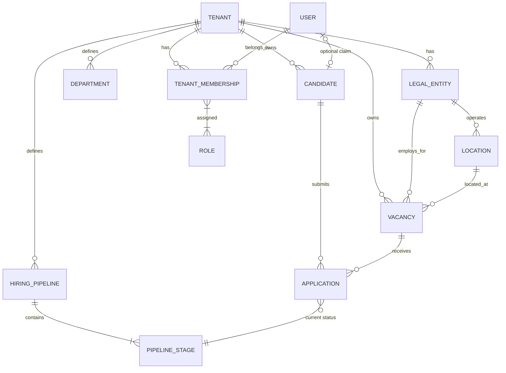
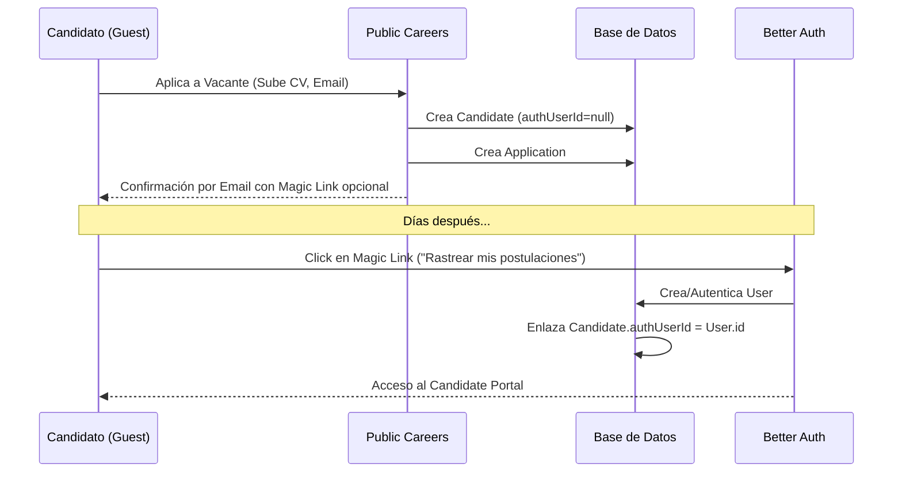
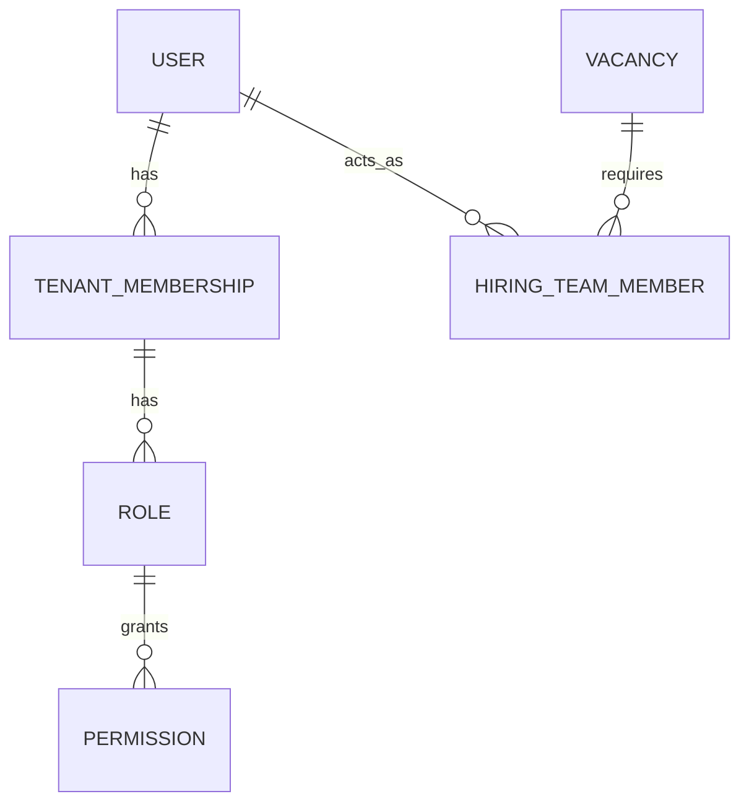

# Iteración 1 — ATS Domain & Product Redesign

**Fecha:** 2026-08-20
**Estado:** Propuesta de Diseño (Pendiente de Aprobación)

---

## 1. Executive Recommendation

La arquitectura objetivo para el ATS es un **Monolito Modular** con **Multi-tenancy real desde el día 1 (Shared Database, Shared Schema con `tenantId` explícito)**. AMA Hospital actuará como el primer Tenant. 

El diseño abandona la idea de forzar el registro de usuarios para postularse, adoptando un flujo de **Guest Application** como estándar de la industria, desacoplando completamente la identidad del candidato (dominio de reclutamiento) de la identidad autenticada (infraestructura de Better Auth). El modelo de dominio se independizará de Prisma, y la estructura organizacional se definirá con precisión (Tenant > LegalEntity > Location) para soportar la realidad corporativa de AMA y futuros clientes SaaS.

---

## 2. Confirmed Decisions

| Decisión | Consecuencia Arquitectónica | Consecuencia de Dominio | Consecuencia de Implementación |
| :--- | :--- | :--- | :--- |
| **Multi-tenancy desde Día 1** | Aislamiento de datos mandatorio. RLS (Row Level Security) o filtrado estricto por `tenantId` en todos los repositorios. | Todas las entidades principales (`Candidate`, `Job`, `Application`, etc.) pertenecen a un `Tenant`. | Añadir `tenantId` a casi todos los modelos Prisma. Claves únicas compuestas (ej. `[tenantId, email]`). |
| **Guest Application** | Better Auth no se invoca en el flujo público. | `Candidate` se separa de `User`. `Candidate.authUserId` es opcional. | Rutas públicas libres de middlewares de sesión. Creación de candidatos sin cuenta. |
| **Org Structure Estricta** | Rechazo de la abstracción genérica `Organization`. | Conceptos explícitos: `Tenant`, `LegalEntity`, `Location`. | Modelos separados en Prisma con jerarquía clara. |
| **Sourcing Manual** | UI de reclutador permite crear candidatos libremente. | Eliminación del modelo paralelo `CandidateLead`. | El origen (Source) se asocia directamente a la `Application` o `Candidate`. |
| **Pipeline Flexible** | Adiós al enum estricto `StageType` único por pipeline. | Las etapas tienen metadatos categóricos (ej. `INTERVIEW`), pero pueden repetirse. | Refactor del motor de pipelines y reglas de transición. |

---

## 3. Discovery Decisions Superseded

*   **Recomendación Anterior:** *Single-tenant MVP con esquema preparado para multi-tenant.*
    *   **Nueva Decisión:** Multi-tenant real desde el día 1. AMA es solo el primer Tenant.
*   **Recomendación Anterior:** *Mantener/Modificar `CandidateLead`.*
    *   **Nueva Decisión:** `CandidateLead` es eliminado completamente. Los leads manuales se modelan como `Candidate` (sin cuenta) + `Application` (con fuente manual).
*   **Recomendación Anterior:** *Separación compleja Job / Requisition / Posting.*
    *   **Nueva Decisión:** Para el MVP, consolidado en un modelo simplificado de `Vacancy/Job` para evitar sobreingeniería temprana.
*   **Recomendación Anterior:** *Aplicar Patrón Aggregate mecánicamente a todo.*
    *   **Nueva Decisión:** Uso selectivo de DDD. Solo entidades con invariantes complejas (ej. `Application`, `HiringPipeline`) serán Aggregates.

---

## 4. Consolidated Domain Model

### Conceptos Clave
*   **Identity & Tenancy:** `User` (Autenticado), `Tenant` (Cliente SaaS), `TenantMembership` (Enlace).
*   **Organization:** `LegalEntity` (Razón Social), `Location` (Sucursal física), `Department` (Área funcional).
*   **Recruiting Core:** `Candidate` (Persona), `Vacancy` (Puesto abierto), `Application` (Proceso de postulación), `HiringPipeline` (Flujo).

### ER Diagram (Lógico)



---

## 5. Tenant / LegalEntity / Location Design

Para soportar AMA y futuros clientes, la jerarquía es explícita y no usa un comodín `Organization`:

1.  **`Tenant`:** El cliente del SaaS (ej. AMA Hospital). Define el límite de aislamiento de datos, configuración global, pipelines base y portal de empleo.
2.  **`LegalEntity`:** La razón social / empleador legal (ej. AMA Anáhuac, AMA Apodaca). Vital para contratos y compliance.
3.  **`Location`:** Sucursal física (ej. Clínica Monterrey, Clínica San Nicolás). Varias Locations pueden pertenecer a una LegalEntity.
4.  **`Department`:** Pertenece al `Tenant` (ej. Enfermería, TI). Se asigna a Vacantes. Evitamos atarlo rígidamente a Locations para permitir departamentos transversales.

*Decisión:* No se necesita la entidad `Organization`. `Tenant` cumple el rol de la organización superior, y `LegalEntity` agrupa las unidades de negocio operativas/legales.

---

## 6. Identity Model

La identidad del candidato se desvincula de la autenticación.

*   **`User` (Better Auth):** Maneja credenciales, sesiones, OAuth. Es global a la plataforma SaaS.
*   **`Candidate` (ATS Domain):** Representa el perfil profesional de una persona dentro de un `Tenant`. Contiene CV, datos de contacto.
*   **Enlace (`Candidate.authUserId`):** Campo opcional. Si un candidato luego decide hacer "Claim" de su perfil (ej. vía Magic Link al correo con el que aplicó), se crea un `User` y se enlaza.
*   **`TenantMembership`:** Define a qué Tenants tiene acceso un `User` interno (Recruiter, Admin) y qué `Role` tiene en ese contexto.



---

## 7. Candidate / Application Model

*   **`Candidate`:** Datos persistentes de la persona (Nombre, Email, Teléfono, CV parseado). Existe independiente de la vacante.
*   **`Application`:** La instancia de una persona aplicando a un puesto. Tiene estado (Stage), notas del reclutador, feedback, expectativas salariales para *este* proceso.
*   **`ApplicationSource`:** Se rastrea a nivel de `Application`. Un candidato puede aplicar hoy vía Facebook y mañana vía referenciado. (Eliminamos `CandidateLead`).

---

## 8. Candidate Deduplication

**Estrategia MVP (Detección Heurística Soft):**

1.  **NO hay constraint estricto en BD** para `UNIQUE(tenantId, email)` al momento de inserción desde fuentes manuales, pero **SÍ** para aplicaciones web directas (para evitar spam idéntico).
2.  **Detección en background/query:** Cuando un reclutador crea o ve un candidato, el sistema busca coincidencias por `email` normalizado o `phone` dentro del mismo `tenantId`.
3.  **Resolución Manual:** La UI muestra una alerta "Posible duplicado detectado". El reclutador puede elegir fusionar o usar el existente. En el MVP, simplemente advertimos y permitimos seleccionar el candidato existente en lugar de crear uno nuevo.

---

## 9. Job Domain Model

Para evitar la sobreingeniería de separar Position, Requisition y Vacancy en el MVP:

*   **`Vacancy` (Reemplaza a JobPosting actual):** Es el modelo central. Representa un puesto abierto para contratación (ej. "Enfermero General - Turno Nocturno").
*   Pertenece a: `Tenant`, `LegalEntity`, `Location`, `Department`.
*   Propiedades: `openings` (cupos), `status` (DRAFT, PUBLISHED, CLOSED).
*   **No hay entidad separada `JobPosting`:** La `Vacancy` misma tiene los campos públicos (`description`, `requirements`) y se publica/despublica controlando su `status`.

---

## 10. Hiring Pipeline Redesign

El límite de 1 tipo de stage por pipeline desaparece.

*   **`HiringPipeline`:** Plantilla base (ej. "Flujo Clínico AMA").
*   **`PipelineStage`:** `id`, `name` (ej. "Entrevista Técnica"), `category` (enum semántico: APPLIED, SCREENING, INTERVIEW, OFFER, OTHER), `order` (int).
*   **Versioning Estrategia MVP (Snapshotting Ligero):** Cuando una `Vacancy` se publica, se "congela" su pipeline. Para el MVP, simplemente asociaremos la Vacante a una versión específica del Pipeline, o no permitiremos borrar Stages si tienen Applications en curso (Soft Delete).
*   **Outcomes:** Los resultados finales (HIRED, REJECTED, WITHDRAWN) **no son stages**, son campos de estado (`outcome`) en la `Application`.

---

## 11. Authorization Model

Modelo de autorización contextual para MVP:



*   **`TenantAdmin`:** Rol global en el Tenant. Acceso a todo.
*   **`Recruiter`:** Rol global en el Tenant. Gestiona vacantes y candidatos.
*   **`HiringManager`:** No tiene acceso global. Su acceso se determina por la tabla `HiringTeamMember` vinculada a una `Vacancy` específica. Solo ve candidatos de las vacantes donde está asignado.

---

## 12. Privacy Model

Infraestructura mínima de privacidad (Privacy-Ready):

*   **`PrivacyPolicyVersion`:** Tabla simple (tenantId, version, text/url, activeFrom).
*   **`ConsentRecord`:** Cuando un candidato aplica vía web, se registra: `candidateId`, `policyVersionId`, `source` ("WEB"), `ipAddress` (opcional), `timestamp`.
*   Si un reclutador crea al candidato manualmente, el `ConsentRecord` reflejará `source` ("MANUAL_ENTRY_BY_RECRUITER") y no implicará aceptación de aviso web.

---

## 13. Bounded Contexts

Context Map para el Monolito Modular:

```mermaid
graph TD
    subgraph Identity Context
        Users
        Sessions
    end
    
    subgraph Organization Context
        Tenants
        LegalEntities
        Locations
        Memberships
    end
    
    subgraph Recruiting Context
        Vacancies
        Candidates
        Applications
        Pipelines
    end
    
    subgraph Careers Context
        PublicJobBoard
        GuestApply
    end
    
    Careers Context -->|Submits Application| Recruiting Context
    Recruiting Context -->|Verifies Access| Organization Context
    Organization Context -->|Authenticates| Identity Context
```

---

## 14. Aggregates

*   **`Application` (Aggregate Root):** Coordina transiciones de Stage, guarda el Historial (`ApplicationStageHistory`), maneja feedback y entrevistas. No se puede modificar un stage sin pasar por el Aggregate.
*   **`Vacancy` (Aggregate Root):** Controla su estado de publicación, su pipeline asociado y su equipo de contratación.
*   *Entidades CRUD:* `Candidate` (es principalmente un registro de datos), `Location`, `Department`.

---

## 15. Domain Events

Eventos recomendados para el MVP (pueden implementarse vía Event Emitter en memoria o outbox pattern simple):
1.  `ApplicationSubmitted`: Dispara correos de confirmación.
2.  `ApplicationStageMoved`: Dispara notificaciones a reclutadores o candidatos si aplica.
3.  `ApplicationRejected`: Dispara correo de rechazo (si está configurado).
4.  `CandidateHired`: Finaliza el proceso y (futuro) notifica a HRIS.

---

## 16. Target Modular Monolith Structure

Estructura de carpetas propuesta, eliminando la confusión actual:

```text
src/
  app/                      # Next.js App Router (UI & API Routes)
    (public)/
    (protected)/
  
  modules/                  # Vertical Slices
    identity/               # Better Auth config & adaptadores
    
    organization/           # Tenants, LegalEntities, Roles
      domain/
      infrastructure/       # Prisma adapters
    
    recruiting/             # Core ATS
      domain/               # Aggregates, Enums independientes
        application/
        vacancy/
        candidate/
      application/          # Use Cases (ej. MoveStageUseCase)
      infrastructure/       # Prisma repositories
```

---

## 17. Prisma Boundary

*   **Regla de Oro:** Ningún archivo dentro de `src/modules/*/domain` puede importar `@prisma/client` o `generated/prisma/client`.
*   **Repositorios:** Se definen interfaces en `domain/` o `application/` (ej. `IApplicationRepository`). Se implementan en `infrastructure/prisma.application.repository.ts`.
*   **Read Models:** Para listados (ej. Dashboard de reclutador), se permite saltar el dominio y usar Prisma directamente en la capa de Queries/UI (`fetchApplicationsDto`) por rendimiento, siempre y cuando no contenga lógica de negocio.

---

## 18. MVP Scope

**IN MVP:**
*   Multi-tenancy (Estructura base, AMA configurado).
*   Gestión de Estructura (Legal Entities, Locations, Departments).
*   Gestión de Vacantes (Crear, publicar, cerrar).
*   Public Careers Page (SEO friendly básico).
*   Guest Application Flow (Sin registro).
*   Creación manual de candidatos por reclutador.
*   Gestión de Applications (Mover por etapas de pipeline flexible).
*   Roles base (Admin, Recruiter).
*   Registro de privacidad básico.

**OUT OF MVP:**
*   Portal del Candidato (Log in para ver estatus).
*   Roles complejos (Hiring Manager contextual puede simplificarse si no es crítico en mes 1).
*   Integraciones (LinkedIn, Indeed, WhatsApp API).
*   Parsing de CV con IA.
*   Analítica avanzada y dashboards interactivos.

---

## 19. Key Invariants

1.  **Tenant Isolation:** Una `Application` no puede vincular un `Candidate` del Tenant A con una `Vacancy` del Tenant B.
2.  **Identity Decoupling:** Un `Candidate` debe poder crearse y transitar todo el pipeline sin tener un `User` asociado.
3.  **Pipeline Coherence:** El `Stage` actual de una `Application` debe pertenecer al `HiringPipeline` asignado a la `Vacancy`.
4.  **Historical Integrity:** El historial de stages de una `Application` no debe mutar retroactivamente si se reconfigura el pipeline maestro.

---

## 20. Risks / Trade-offs

| Decisión | Beneficio | Costo / Riesgo | Mitigación |
| :--- | :--- | :--- | :--- |
| **Shared Schema Multi-tenancy** | Fácil mantenimiento, menor costo de infra. | Riesgo crítico de fuga de datos cruzados. | Usar Prisma Client Extensions para forzar el filtro de `tenantId` automáticamente, o políticas estrictas en repositorios. |
| **Guest Application** | Altísima conversión de postulantes. | Posibles perfiles duplicados. | Reglas de soft-deduplication en UI para reclutadores. |
| **No Candidate Portal (MVP)** | Acelera el time-to-market. | Los candidatos no ven su estatus en tiempo real. | Comunicaciones por email automatizadas mediante Domain Events. |

---

## 21. Decision Matrix (Resumen)

| Área | Alternativas | Recomendación | Por qué |
| :--- | :--- | :--- | :--- |
| **Arquitectura BD** | DB-per-tenant vs Shared Schema | **Shared Schema + tenantId** | Menor fricción operativa para MVP, escala bien a mediano plazo. |
| **Org Abstraction** | Generic "Organization" vs Nombres Legales | **Tenant > LegalEntity > Location** | Refleja la realidad fiscal y operativa requerida por RRHH. |
| **Candidato Auth** | Registro Obligatorio vs Guest | **Guest Apply + Optional Claim** | Maximiza volumen de candidatos. Cumple requerimiento de negocio. |
| **Pipelines** | Tipos únicos (estricto) vs Metadata Flexible | **Categorías semánticas repetibles** | Permite múltiples entrevistas o filtros técnicos en un mismo flujo. |
| **Estructura Código** | Capas Planas (Actual) vs Modular Monolith | **Modular Monolith** | Aísla dominios y evita el acoplamiento infraestructura-dominio actual. |

---

## 22. Decision Backlog After Iteration 1

**Critical (Requiere input antes de implementar)**
1. *¿Cómo manejaremos el ruteo público de vacantes para múltiples tenants?* (ej. `ama.ats.com/jobs` vs `ats.com/ama/jobs`). Esto afecta el diseño del App Router.

**High**
2. *¿Para el MVP, necesitamos aislar visualmente el branding (logos, colores primarios) en la página pública de carreras por Tenant?*

**Medium**
3. *¿Qué campos exactos son obligatorios en el flujo de Guest Application de AMA Hospital?* (ej. ¿CV obligatorio? ¿Teléfono obligatorio?).

**Low**
4. *Estrategia futura para migración de Candidatos si AMA decide crear perfiles globales compartidos entre sus Legal Entities vs aislados.* (Resuelto temporalmente: Todo vive bajo el Tenant AMA).
