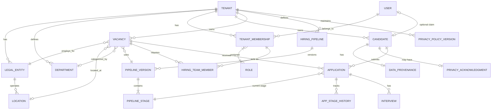
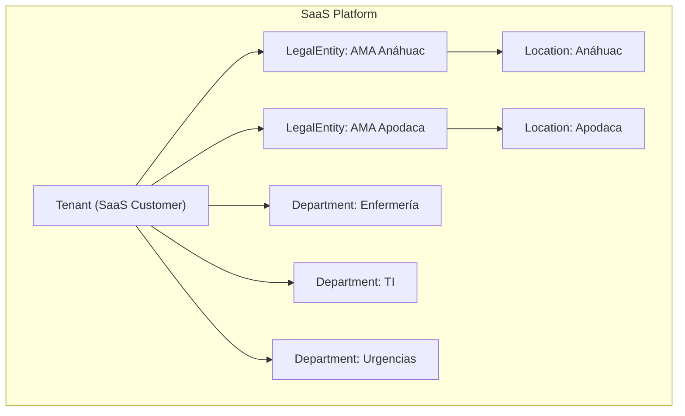
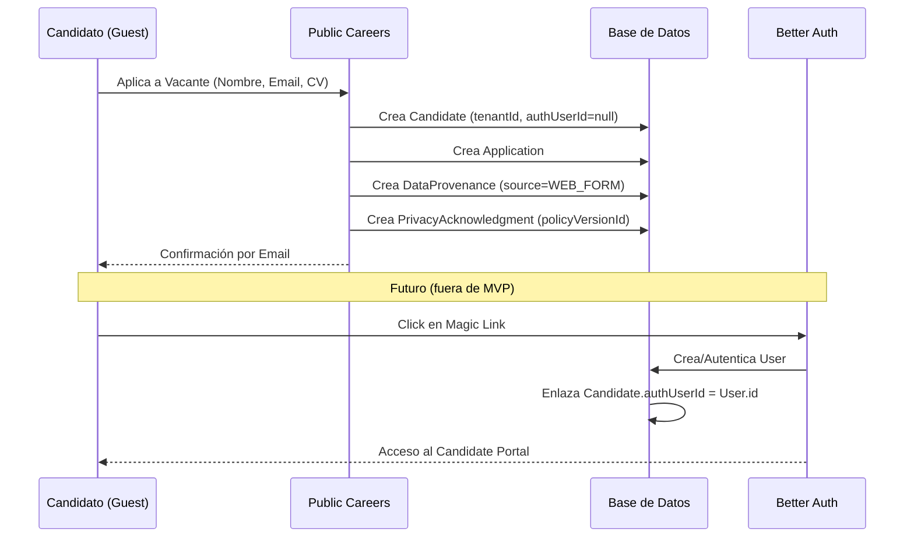
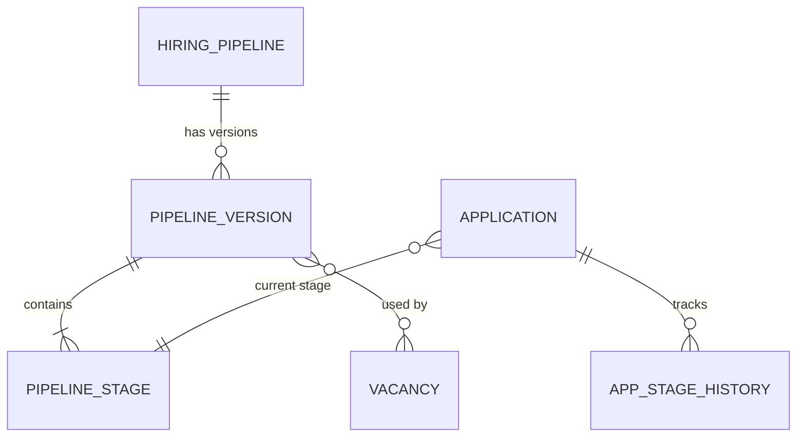
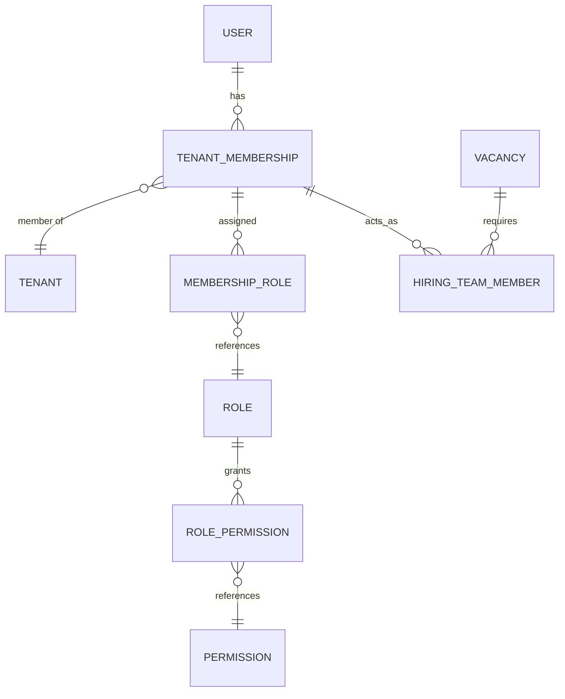
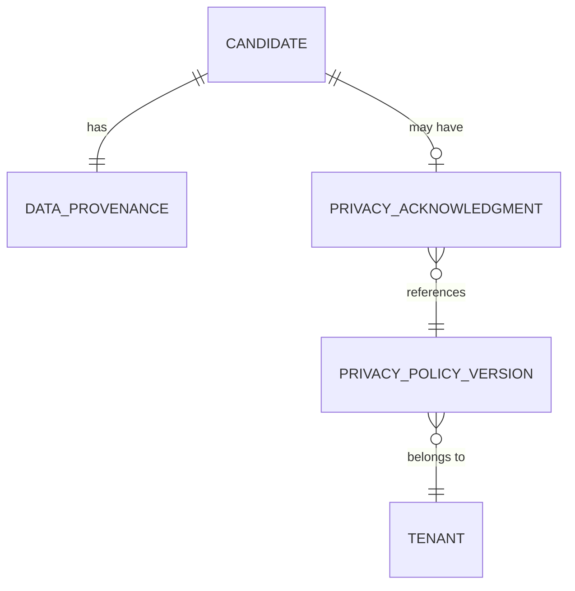
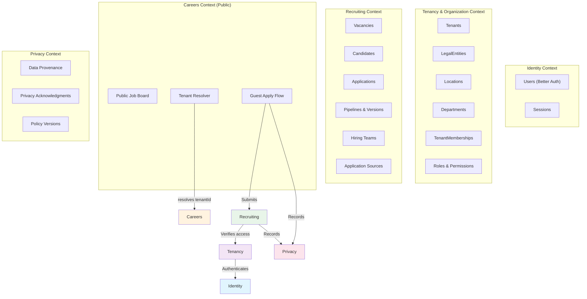
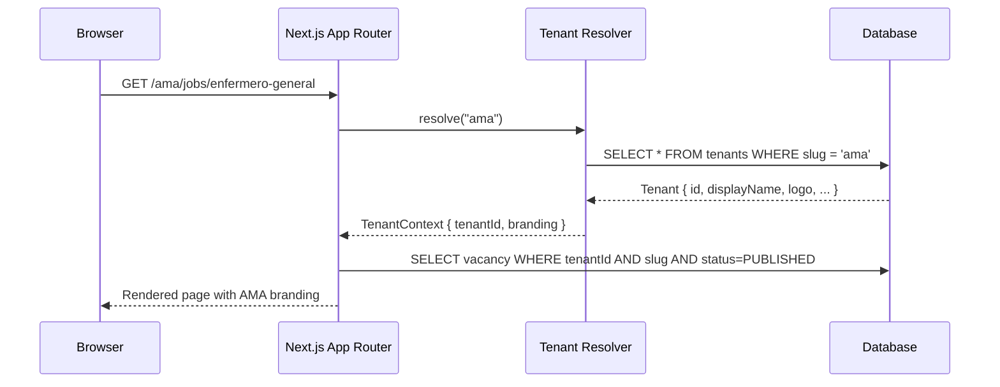

# Iteración 1 — ATS Domain & Product Redesign

**Fecha:** 2026-08-20 (Iteración 1) · 2026-09-01 (Iteración 1.1)
**Estado:** Iteración 1 + 1.1 consolidada. Pendiente de Architecture Decision Review (Iteración 2).

---

## 1. Executive Recommendation

La arquitectura objetivo para el ATS es un **Monolito Modular** con **Multi-tenancy real desde el día 1** (Shared Database, Shared Schema con `tenantId` explícito). AMA Hospital será el primer Tenant de producción.

El producto es un **ATS SaaS comercial genérico**. AMA no es una implementación especial; es el primer cliente real que valida el producto. Los requerimientos específicos de AMA deben resolverse como configuración de Tenant, no como lógica de negocio hardcodeada.

El diseño adopta un flujo de **Guest Application** como estándar, desacoplando completamente la identidad del candidato (dominio de reclutamiento) de la identidad autenticada (infraestructura de Better Auth). El modelo de dominio se independizará de Prisma, y la estructura organizacional se define con precisión: Tenant → LegalEntity → Location.

Las decisiones sobre ruteo público, branding, campos de aplicación, deduplicación, pipeline versioning, privacidad, y Hiring Manager han sido cerradas en Iteración 1.1.

---

## 2. Confirmed Decisions

| Decisión | Consecuencia Arquitectónica | Consecuencia de Dominio | Consecuencia de Implementación |
| :--- | :--- | :--- | :--- |
| **Multi-tenancy desde Día 1** | Aislamiento de datos mandatorio. Filtrado estricto por `tenantId` en todos los repositorios. Mecanismo de enforcement (repositorios, RLS, extension, etc.) a determinar en Iteración 2/3. | Todas las entidades principales pertenecen a un `Tenant`. | Añadir `tenantId` a casi todos los modelos Prisma. Claves únicas compuestas tenant-scoped. |
| **SaaS Genérico** | No existen code paths condicionales por Tenant (`if tenant === "AMA"`). AMA-specific → Tenant config. | Un solo core de dominio reutilizable. | Sin ramas de negocio hardcoded. |
| **Guest Application** | Better Auth no se invoca en el flujo público. | `Candidate` separado de `User`. `Candidate.authUserId` es opcional. | Rutas públicas libres de middlewares de sesión. |
| **Org Structure Explícita** | Rechazo de la abstracción genérica `Organization`. | Conceptos explícitos: `Tenant`, `LegalEntity`, `Location`. | Modelos separados en Prisma con jerarquía clara. |
| **Sourcing Manual** | UI de reclutador permite crear candidatos libremente. | Eliminación de `CandidateLead`. | El origen se asocia directamente a `Application`. |
| **Pipeline Inmutable Versionado** | Cada Vacancy referencia una PipelineVersion específica e inmutable. | Las etapas tienen categorías semánticas repetibles. Los resultados terminales son un campo separado de la Application. | Nuevo modelo PipelineVersion entre HiringPipeline y PipelineStage. |
| **Public Routing `/{tenantSlug}/jobs/{vacancySlug}`** | Tenant Resolver como capa de infraestructura. El dominio recibe `tenantId`, no slugs de URL. | Recruiting no depende de estructura de URL. | Next.js dynamic routes `[tenantSlug]`. Futuro soporte para subdominios/dominios custom sin cambiar dominio. |
| **Branding Mínimo por Tenant** | Campos de branding directamente en `Tenant`. | Public careers muestra nombre, logo y color del Tenant. | Sin theme builder. Sin white-label avanzado. |
| **Privacidad: Provenance ≠ Acknowledgment** | Dos conceptos separados en persistencia. | `DataProvenance` registra cómo/cuándo llegaron los datos. `PrivacyAcknowledgment` registra aceptación consciente de aviso. | No se fabrican consent records para datos capturados manualmente por reclutadores. |
| **Dedup Channel-Independent** | No hay reglas de unicidad diferentes por canal de ingreso. | Candidato email no es globalmente único. Detección heurística soft, tenant-scoped. | Índices tenant-scoped para búsqueda. Alertas UI de duplicados. |
| **Hiring Manager en MVP Domain** | `HiringTeamMember` vincula Users a Vacancies con responsabilidades contextuales. | Un médico puede ser HiringManager en una Vacancy sin rol global especial. | Tabla de HiringTeamMember. Authorization scoped por Vacancy. |

---

## 3. Discovery Decisions Superseded

| Recomendación del Discovery Report | Nueva Decisión (It. 1 + 1.1) | Razón |
| :--- | :--- | :--- |
| Single-tenant MVP con esquema "preparado para multi-tenant" | Multi-tenant real desde día 1. AMA = primer Tenant. | Decisión de producto confirmada. |
| Mantener/Modificar `CandidateLead` | Eliminado completamente. | Creaba un motor de estados paralelo innecesario. |
| Separación compleja Job/Requisition/Posting | `Vacancy` como modelo único para MVP. | Sobreingeniería prematura sin requerimiento concreto. |
| Aplicar patrón Aggregate mecánicamente | Uso selectivo de DDD solo donde existen invariantes reales. | Evitar ceremonia innecesaria. |
| Soft-delete de stages como estrategia de integridad histórica | Immutable PipelineVersion. | Soft-delete no garantiza coherencia histórica. |
| Dedup diferenciada por canal (web con unique, manual sin unique) | Reglas de dedup channel-independent. | La identidad del candidato no depende del canal de ingreso. |
| `ConsentRecord` con `source=MANUAL_ENTRY` implica consent | Separación explícita entre DataProvenance y PrivacyAcknowledgment. | Un reclutador ingresando datos no equivale a consentimiento del candidato. |
| Hiring Manager potencialmente fuera de MVP | HiringManager en MVP domain via HiringTeamMember. | Necesario para authorization scoped por Vacancy. |
| Prisma Client Extensions como mecanismo de tenant isolation | Mecanismo de enforcement por definir en It. 2/3. Solo se documenta el invariante. | Decisión de implementación prematura. |

---

## 4. Consolidated Domain Model

### Conceptos Clave

*   **Platform & Tenancy:** `User` (autenticado, global SaaS), `Tenant` (cliente SaaS, boundary de datos), `TenantMembership` (enlace User↔Tenant con roles).
*   **Organization Structure:** `LegalEntity` (razón social), `Location` (sucursal física), `Department` (área funcional, transversal al Tenant).
*   **Recruiting Core:** `Candidate` (persona, tenant-scoped), `Vacancy` (puesto abierto), `Application` (proceso de postulación), `HiringPipeline` → `PipelineVersion` → `PipelineStage`.
*   **Collaboration:** `HiringTeamMember` (acceso contextual a Vacancy).
*   **Privacy:** `DataProvenance` (origen de los datos), `PrivacyAcknowledgment` (aceptación de aviso).
*   **Audit:** `AuditLog` (trail de auditoría tenant-scoped).

### ER Diagram (Lógico)



---

## 5. Tenant / LegalEntity / Location / Department Design

### Hierarchy



### Entity Definitions

1.  **`Tenant`:** El cliente del SaaS. Define el límite de aislamiento de datos, configuración global, branding público, pipelines y catálogos. Campos de branding directamente en Tenant: `displayName`, `slug`, `logoUrl`, `careersTitle`, `primaryColor`, `faviconUrl` (opcional).
2.  **`LegalEntity`:** La razón social / empleador legal. Vital para contratos, nómina downstream y compliance. Pertenece a un `Tenant`. Una LegalEntity puede operar múltiples Locations.
3.  **`Location`:** Sucursal física u operativa. Pertenece a una `LegalEntity`. Contiene datos de dirección y geolocalización.
4.  **`Department` (Pertenece a Tenant — Option A):** Área funcional definida a nivel de Tenant (ej. Enfermería, TI). La Vacancy vincula Department independientemente de LegalEntity/Location. Esto permite que "Enfermería" exista una sola vez en AMA aunque opere en ambas locations. Un Vacancy de "Enfermería en Apodaca" se expresa como `Vacancy { departmentId: enfermeria, legalEntityId: apodaca, locationId: apodaca }`, no duplicando el departamento.

### Decision: No `Organization` entity

`Tenant` cumple el rol de la organización superior. `LegalEntity` agrupa las unidades jurídicas. No hay requerimiento de dominio concreto que `Organization` resolvería que Tenant o LegalEntity no cubran ya.

---

## 6. Identity Model

### Principio Fundamental

```text
User ≠ Candidate
Internal Workforce Identity ≠ External Candidate Identity
```

### Definitions

*   **`User` (Better Auth):** Maneja credenciales, sesiones, OAuth. Es global a la plataforma SaaS (un User puede tener membresías en múltiples Tenants).
*   **`TenantMembership`:** Enlaza User a Tenant con roles internos. Solo para personal interno (Recruiters, Admins, etc.).
*   **`Candidate` (ATS Domain):** Perfil profesional de una persona dentro de un `Tenant`. Contiene nombre, email, teléfono, CV. Existe sin autenticación.
*   **`Candidate.authUserId` (optional):** Campo opcional para futuro Account Claiming. Cuando un candidato usa Magic Link para rastrear sus postulaciones, se crea un `User` y se enlaza. NO se crean Users anónimos para representar candidatos guest.

### ¿Es `Candidate.authUserId` suficiente para MVP?

**Sí.** Para el MVP, la relación directa `Candidate.authUserId?` es suficiente. Un candidato es tenant-scoped. Si el mismo humano aplica a dos Tenants, serán dos registros de Candidate separados, cada uno con su propio potencial `authUserId`. En el futuro, si se necesita una identidad cross-tenant, se evaluará una abstracción separada (Identity Graph), pero NO se introduce ahora. La prioridad es:

```text
Simple MVP + No future contradiction
```

Un `User` autenticado vinculado a un Candidate en Tenant A no obtiene acceso automático a datos del Tenant B. La relación `authUserId` solo sirve para resolver "¿quién es este candidato autenticado dentro de este Tenant?"

### Lifecycle



---

## 7. Candidate / Application Model

### Candidate

Datos persistentes de la persona, tenant-scoped:

*   `tenantId`
*   `firstName`, `lastName`
*   `email` (normalizado, indexado, NO globally unique)
*   `phone` (normalizado, indexado)
*   `cvUrl`, `cvRaw`, `cvParsedData`
*   `authUserId?` (optional future claim)
*   `status` (ACTIVE, INACTIVE, ARCHIVED)

### Application

Instancia de una persona aplicando a un puesto:

*   `tenantId`
*   `candidateId`, `vacancyId`
*   `sourceId` (origen de ESTA aplicación: WEB, WHATSAPP, REFERRAL, etc.)
*   `currentStageId` (referencia a PipelineStage de la PipelineVersion de la Vacancy)
*   `outcome` (NONE, HIRED, REJECTED, WITHDRAWN, CANCELLED)
*   `rejectionReasonId?`
*   `appliedAt`, `createdById?`

### ApplicationSource (Catálogo)

Catálogo de fuentes tenant-scoped: Website, LinkedIn, WhatsApp, Facebook, Indeed, Referral, Walk-in, Employment Fair, Agency, Import, etc.

### CandidateLead: ELIMINADO

No existe. Los leads manuales se modelan como `Candidate` (sin cuenta) + `Application` (con sourceId correspondiente).

### Workflows

**Public Guest Applicant:**
```text
Public Vacancy → Form (name, email, phone, CV, privacy) → Candidate created → Application created → DataProvenance (WEB_FORM) + PrivacyAcknowledgment → Confirmation email
```

**Recruiter-Sourced Candidate:**
```text
Recruiter → Search Candidate → Not found → Create Candidate (source=WHATSAPP) → DataProvenance (RECRUITER_MANUAL, source=WHATSAPP, collectedBy=recruiterId) → Select Vacancy → Create Application → Pipeline starts
```

**Returning Candidate:**
```text
Recruiter → Search Candidate → Found → Select existing Candidate → New Vacancy → Create Application (new source) → New pipeline process
```

---

## 8. Candidate Deduplication

### Principio: Channel-Independent

Las reglas de identidad del candidato NO dependen del canal de adquisición. El mismo modelo se aplica a web, WhatsApp, recruiter manual, etc.

### Persistence Layer (Hard Constraints)

*   `Candidate.email`: normalizado, indexado, tenant-scoped. **NO unique.**
*   `Candidate.phone`: normalizado, indexado cuando disponible. **NO unique.**
*   `Application @@unique([candidateId, vacancyId])`: Un candidato no puede tener dos Applications activas para la misma Vacancy. Esto es un invariante de Application, no de identidad del Candidate.

### Application-Level Deterministic Check

Antes de crear una Application, verificar:

```text
¿Existe ya una Application activa para este Candidate + Vacancy?
→ Sí → Rechazar o requerir acción explícita del recruiter
→ No → Continuar
```

### Soft Duplicate Detection (Heuristic)

Al crear o buscar un candidato, la UI muestra coincidencias potenciales:

*   **email normalizado** coincide dentro del mismo Tenant
*   **phone normalizado** coincide dentro del mismo Tenant
*   **nombre similar** (fuzzy match, future improvement)

El sistema muestra: `"Posible duplicado detectado: Juan Pérez (juan@example.com, 8112345678)"`

El recruiter decide:
*   Seleccionar el candidato existente
*   Crear uno nuevo intencionalmente

### Out of MVP

*   Merge automático de candidatos
*   CURP-based dedup (posible futuro)
*   Candidate merge UI (manual merge workflow)

---

## 9. Job Domain Model

### Decision: `Vacancy` como modelo único para MVP

Para el MVP, `Vacancy` consolida los conceptos de puesto abierto, requisición interna y publicación pública.

**Validación:** ¿Puede `Vacancy` representar todo lo necesario?

| Concepto | Cómo se representa en Vacancy |
| :--- | :--- |
| Internal opening | `Vacancy` con `status: DRAFT` |
| Number of openings | `openings: Int`, `positionsFilled: Int` |
| Public job content | `title`, `slug`, `description`, `responsibilities`, `requirements`, `benefits` |
| Published/unpublished | `status: PUBLISHED` vs `DRAFT` / `CLOSED` |
| Legal employer | `legalEntityId` → LegalEntity |
| Physical location | `locationId?` → Location |
| Department | `departmentId?` → Department |
| Hiring Pipeline | `pipelineVersionId` → PipelineVersion |
| Hiring Team | `HiringTeamMember[]` relation |
| Applications | `Application[]` relation |
| SEO | `slug @@unique([tenantId, slug])`, `metaTitle`, `metaDescription` |
| Google for Jobs | `employmentType`, `salaryMin/Max`, `publishedAt`, `validThrough`, Location address via relation |

**Resultado:** Una entidad `JobPosting` separada NO está justificada en el MVP. No existe un invariante de negocio concreto que requiera separar "el puesto abierto" de "la publicación del puesto." Ambos comparten el mismo ciclo de vida en el contexto actual.

Si un futuro Tenant necesita publicar la misma vacancy en múltiples job boards con contenido diferente, se evaluará `JobPosting` como extensión de producto.

### Vacancy Lifecycle

```text
DRAFT → PUBLISHED → PAUSED → CLOSED
                  ↘         ↗
                   CLOSED
```

*   **DRAFT:** Vacante creada, no visible públicamente. Editable.
*   **PUBLISHED:** Visible en careers page. Recibe applications. `publishedAt` se registra.
*   **PAUSED:** Temporalmente no visible. Applications existentes siguen su pipeline. No recibe nuevas.
*   **CLOSED:** Finalizada. No recibe nuevas applications. Razón: positionsFilled, cancelada, u otra.

Una Vacancy se puede cerrar automáticamente cuando `positionsFilled >= openings` (configurable) o manualmente por Recruiter/Admin.

Cerrar una Vacancy NO cierra/rechaza automáticamente las Applications activas. Esa es una acción separada del recruiter.

---

## 10. Hiring Pipeline Redesign

### Model



### Entities

*   **`HiringPipeline`:** Template/nombre del flujo (ej. "Flujo Clínico", "Flujo Administrativo"). Pertenece a un `Tenant`. Contiene metadata del pipeline como entidad organizativa.
*   **`PipelineVersion`:** Versión inmutable del pipeline. `id`, `pipelineId`, `version` (Int), `status` (DRAFT, PUBLISHED, ARCHIVED). Una vez `PUBLISHED` y asociada a Vacancies/Applications, es **inmutable** para cambios estructurales.
*   **`PipelineStage`:** Etapa dentro de una PipelineVersion. `id`, `pipelineVersionId`, `name` (ej. "Entrevista RH"), `category` (StageCategory enum), `order` (Int), `isInitial` (Boolean), `isFinal` (Boolean).

### Stage Categories (Semantic, Repeatable)

```text
APPLIED
SCREENING
CONTACT
INTERVIEW
ASSESSMENT
DOCUMENTATION
OFFER
OTHER
```

Múltiples stages pueden compartir la misma categoría:
```text
Entrevista RH       → category: INTERVIEW, order: 3
Entrevista Coord.   → category: INTERVIEW, order: 4
Entrevista Dir.     → category: INTERVIEW, order: 5
```

### Application Outcomes (Separate from Stages)

```text
ApplicationOutcome
  NONE        # In process
  HIRED       # Successfully hired
  REJECTED    # Rejected by organization
  WITHDRAWN   # Candidate withdrew
  CANCELLED   # Process cancelled
```

El outcome vive en `Application.outcome`, NO es un stage. Un stage como "Oferta" no implica automáticamente `HIRED`; eso requiere una acción explícita.

### Versioning Strategy: Immutable Pipeline Versions

```text
Pipeline "Flujo Clínico" (Template)
│
├── Version 1 (PUBLISHED) ← Vacancy A references this
│    ├── Recepción       (APPLIED, order:1, isInitial:true)
│    ├── Filtro          (SCREENING, order:2)
│    ├── Entrevista RH   (INTERVIEW, order:3)
│    ├── Oferta          (OFFER, order:4)
│    └── Contratación    (OTHER, order:5, isFinal:true)
│
└── Version 2 (DRAFT) ← Editing, not yet used
     ├── Recepción       (APPLIED, order:1, isInitial:true)
     ├── Filtro          (SCREENING, order:2)
     ├── Psicometría     (ASSESSMENT, order:3)  ← NEW
     ├── Entrevista RH   (INTERVIEW, order:4)
     ├── Documentación   (DOCUMENTATION, order:5) ← NEW
     ├── Oferta          (OFFER, order:6)
     └── Contratación    (OTHER, order:7, isFinal:true)
```

Workflow para editar:
```text
Pipeline Version 1 (PUBLISHED, in use)
       │
       ▼
"Create new version" → Version 2 (DRAFT, copied from V1)
       │
       ▼
Edit Version 2
       │
       ▼
Publish Version 2 → PUBLISHED
       │
       ▼
New Vacancies may use V2
Existing Vacancies remain on V1
```

### Key Invariant

```text
Application.currentStageId must reference a PipelineStage 
that belongs to the same PipelineVersion 
that the Application's Vacancy references.
```

---

## 11. Authorization Model

### MVP Structure



### Roles

*   **`TenantAdmin`:** Acceso completo a configuración y operación del Tenant.
*   **`Recruiter`:** Gestiona vacantes, candidatos, applications a nivel de Tenant (o scoped por LegalEntity/Location si se configura).
*   **`HRManager`:** Visibilidad supervisora más amplia que Recruiter. Configura pipelines, catálogos, métricas.
*   **`HiringManager`:** NO tiene rol global. Su acceso se determina por `HiringTeamMember` vinculada a una `Vacancy` específica.

### HiringTeamMember

```text
Vacancy
   └── HiringTeamMember
          ├── tenantMembershipId  → quién
          └── responsibility      → qué rol en esta vacancy
```

Responsibilities (enum):
```text
RECRUITER         # Recruiter asignado a esta vacancy
HIRING_MANAGER    # Manager que aprueba/decide contratación
INTERVIEWER       # Participa en entrevistas/evaluaciones
```

NO se usan roles industry-specific como `DOCTOR`. Un médico en AMA que participa en entrevistas se asigna como `HiringTeamMember { responsibility: INTERVIEWER }`.

### Scoping Examples

| Actor | Scope | Mechanism |
| :--- | :--- | :--- |
| TenantAdmin | Todo el Tenant | Role `TenantAdmin` on `TenantMembership` |
| Recruiter | Tenant-wide (o scoped a LegalEntity/Location) | Role `Recruiter` on `TenantMembership` |
| HRManager | Tenant-wide con mayor visibilidad | Role `HRManager` on `TenantMembership` |
| HiringManager | Solo Vacancies asignadas | `HiringTeamMember { responsibility: HIRING_MANAGER }` on specific Vacancy |
| Interviewer | Solo Vacancies asignadas | `HiringTeamMember { responsibility: INTERVIEWER }` on specific Vacancy |

---

## 12. Privacy Model

### Principio Fundamental

```text
Data Provenance ≠ Privacy Acknowledgment
```

Registrar de dónde vinieron los datos de un candidato NO equivale a decir que el candidato aceptó el aviso de privacidad.

### Entities



*   **`PrivacyPolicyVersion`:** Tabla tenant-scoped. `tenantId`, `version`, `contentUrl` o `contentHash`, `effectiveFrom`, `isActive`. Cada Tenant mantiene su propio aviso de privacidad.

*   **`DataProvenance`:** Registra CÓMO y CUÁNDO llegaron los datos del candidato al sistema.
    *   `candidateId`
    *   `source`: enum (WEB_FORM, RECRUITER_MANUAL, IMPORT, API)
    *   `acquisitionChannel`: string o FK a ApplicationSource (WHATSAPP, LINKEDIN, WALK_IN, etc.)
    *   `collectedAt`: timestamp
    *   `collectedById?`: userId del recruiter si aplica
    *   `notes?`: contexto adicional

*   **`PrivacyAcknowledgment`:** Registra ACEPTACIÓN CONSCIENTE del aviso de privacidad. Solo se crea cuando el candidato REALMENTE aceptó.
    *   `candidateId`
    *   `policyVersionId`
    *   `acknowledgedAt`: timestamp
    *   `method`: enum (WEB_CHECKBOX, SIGNED_DOCUMENT, VERBAL_RECORDED, EMAIL_CONFIRMATION)
    *   `ipAddress?`: si fue vía web
    *   `evidenceMetadata?`: JSON con detalles adicionales

### Scenarios

| Escenario | DataProvenance | PrivacyAcknowledgment |
| :--- | :--- | :--- |
| Guest aplica vía web | ✅ source=WEB_FORM | ✅ method=WEB_CHECKBOX |
| Recruiter captura desde WhatsApp | ✅ source=RECRUITER_MANUAL, channel=WHATSAPP | ❌ No se crea (no hay aceptación) |
| Recruiter captura y luego el candidato firma aviso | ✅ source=RECRUITER_MANUAL | ✅ Se crea cuando firma (method=SIGNED_DOCUMENT) |
| Import masivo de CVs | ✅ source=IMPORT | ❌ Requiere proceso separado de consentimiento |

---

## 13. Bounded Contexts

### Context Map



### Module Boundaries for MVP

| Context | Is a Separate Module? | Rationale |
| :--- | :--- | :--- |
| Identity | Yes (`identity/`) | Better Auth wrapper. Thin. |
| Tenancy & Organization | Yes (`organization/`) | Core SaaS infrastructure. |
| Recruiting | Yes (`recruiting/`) | Core ATS domain. Largest module. |
| Careers | Submodule of Recruiting or App Router concern | Thin public read layer + Guest Apply. |
| Privacy | Submodule of Recruiting | Small, tightly coupled to Candidate/Application lifecycle. |

---

## 14. Aggregates

### Rich Aggregates (Real Invariants)

*   **`Application` (Aggregate Root):**
    *   **Invariants:** Stage must belong to the Vacancy's PipelineVersion. Outcome transitions follow rules (NONE→HIRED, NONE→REJECTED, etc.). Cannot move stage after terminal outcome.
    *   **Transactional boundary:** Application + StageHistory entry are created/updated atomically.
    *   **Why aggregate:** Multiple entities (Application, StageHistory, Interviews) share invariants that require transactional coordination.

*   **`PipelineVersion` (Aggregate Root):**
    *   **Invariants:** Must have at least one initial stage. Stages must have unique order. Published versions are immutable.
    *   **Transactional boundary:** PipelineVersion + all its PipelineStages.
    *   **Why aggregate:** Structural integrity of the pipeline must be enforced as a unit.

### Entities with Lifecycle Rules (Light Aggregates)

*   **`Vacancy`:**
    *   **Invariants:** Status transitions (DRAFT→PUBLISHED requires pipelineVersionId). Cannot publish without at least legalEntityId.
    *   Could be aggregate or handled at application layer. Lean toward application-layer service.

### Simple CRUD Entities (No Aggregate Pattern)

*   `Candidate` — primarily a data record. Dedup is application-level heuristics, not domain invariant.
*   `Department`, `Location`, `LegalEntity` — configuration data.
*   `ApplicationSource` — catalog data.
*   `HiringTeamMember` — assignment record.
*   `PrivacyPolicyVersion`, `DataProvenance`, `PrivacyAcknowledgment` — records.

---

## 15. Domain Events

Events conceptuales para el MVP. Implementación (in-memory emitter, outbox, etc.) se define en It. 2/3.

| Event | When | Potential Reactions |
| :--- | :--- | :--- |
| `ApplicationSubmitted` | Guest or recruiter creates application | Confirmation email, audit log |
| `ApplicationStageMoved` | Recruiter moves application to next stage | Notifications, audit log |
| `ApplicationRejected` | Application outcome set to REJECTED | Rejection email (if configured), audit |
| `ApplicationWithdrawn` | Candidate withdraws | Audit log |
| `CandidateHired` | Application outcome set to HIRED | Future HRIS integration event, audit |
| `VacancyPublished` | Vacancy status → PUBLISHED | Audit log, sitemap refresh |
| `VacancyClosed` | Vacancy status → CLOSED | Audit log |

Events that are NOT needed for MVP: complex workflow triggers, scheduled actions, AI events.

---

## 16. Target Modular Monolith Structure

```text
src/
  app/                          # Next.js App Router
    [tenantSlug]/               # Public tenant-scoped routes
      jobs/
        [vacancySlug]/
    (protected)/                # Authenticated internal routes
      dashboard/
      recruiter/
      admin/
    (auth)/                     # Login, Register
    api/                        # Route Handlers

  modules/
    identity/                   # Better Auth config & adapters
      infrastructure/           # auth.ts, auth-client.ts, auth.server.ts

    organization/               # Tenancy, Org Structure, Authorization
      domain/                   # Tenant, LegalEntity, Location types & rules
      application/              # Membership use cases, role assignment
      infrastructure/           # Prisma repositories

    recruiting/                 # Core ATS
      domain/
        candidate/              # Candidate types, dedup rules
        vacancy/                # Vacancy types, lifecycle rules
        application/            # Application aggregate, stage transition rules, outcome rules
        pipeline/               # Pipeline, PipelineVersion, PipelineStage types, version rules
      application/              # Use Cases (SubmitApplication, MoveStage, PublishVacancy, etc.)
      infrastructure/           # Prisma repositories, read projections

    privacy/                    # Could be submodule of recruiting
      domain/                   # Provenance, Acknowledgment types
      infrastructure/           # Repositories

  shared/                       # Cross-cutting utilities
    types/                      # Common types (TenantContext, etc.)
    utils/                      # Helpers

  components/                   # React UI components
    ui/                         # shadcn/ui primitives
```

Only create folders/layers when they contain actual content. No empty ceremonial directories.

---

## 17. Prisma Boundary

*   **Golden Rule:** No file in `src/modules/*/domain/` may import `@prisma/client` or `generated/prisma/client`.
*   **Repository Ports:** Interfaces defined in `domain/` or `application/` (e.g., `IApplicationRepository`). Implemented in `infrastructure/`.
*   **Read Models:** For read-heavy UI screens (dashboards, listings), direct Prisma queries in the application/presentation layer are acceptable IF they contain no business logic. Avoid unnecessary mapping for trivial reads.
*   **Transactions:** When an aggregate requires atomic writes (e.g., Application + StageHistory), the repository implementation handles the `$transaction`.
*   **Mapping:** Use mappers only where domain types genuinely differ from persistence types. Don't create pass-through mappers for simple entities.

---

## 18. MVP Scope

### IN MVP

*   Multi-tenancy infrastructure (Tenant entity, tenantId scoping, Tenant Resolver)
*   Tenant branding (displayName, logo, primaryColor, careersTitle)
*   Organization structure (LegalEntities, Locations, Departments for AMA)
*   Vacancy management (Create, Edit, Publish, Pause, Close)
*   Public Careers Page (`/{tenantSlug}/jobs`) with basic SEO & Google for Jobs structured data
*   Guest Application Flow (name, email, phone, CV, privacy acknowledgment)
*   Recruiter manual candidate creation (multi-channel)
*   Candidate soft duplicate detection (warn, allow selection)
*   Application lifecycle (Create, move stages, reject, hire)
*   Immutable pipeline versioning
*   Flexible stages with semantic categories
*   Application outcomes (HIRED, REJECTED, WITHDRAWN, CANCELLED)
*   Rejection reasons (tenant-scoped catalog)
*   Application source tracking
*   Roles: TenantAdmin, Recruiter, HRManager
*   HiringTeamMember on Vacancy (Recruiter, HiringManager, Interviewer responsibilities)
*   Data Provenance recording
*   Privacy Acknowledgment recording (web form)
*   PrivacyPolicyVersion per Tenant
*   Audit logging (tenant-scoped)
*   Basic recruiter notes on applications

### OUT OF MVP

*   Candidate Portal (log in, track status)
*   Account Claiming (Magic Link)
*   Candidate merge/dedup UI
*   Automated CURP-based dedup
*   Advanced vacancy-specific application questions / form builder
*   External integrations (LinkedIn, Indeed, WhatsApp API, job board posting)
*   CV parsing with AI
*   AI screening / scoring
*   Advanced analytics dashboards
*   Custom domains / subdomains for careers
*   Theme builder / advanced white-label
*   Offer management workflow
*   Onboarding / HRIS features
*   PlatformAdmin (SaaS platform administration)
*   Event sourcing / message brokers
*   Automated workflow engine
*   Psychometric evaluation platform
*   Automated interview scheduling
*   Email templates / campaign system

### AMA Tenant Implementation Review (Future Exercise)

After the generic architecture is consolidated, a separate AMA-specific review will map AMA's real recruiting operation (pipelines, sources, departments, roles, candidate fields, interview process) into Tenant configuration. This is NOT a generic domain redesign; it populates configuration.

---

## 19. Key Invariants

### Tenant Isolation

1.  `Application.tenantId` must equal `Candidate.tenantId` AND `Vacancy.tenantId`.
2.  `Vacancy.tenantId` must equal `Vacancy.legalEntity.tenantId`.
3.  `Vacancy.tenantId` must equal `Vacancy.location.legalEntity.tenantId` (when location is set).
4.  `HiringTeamMember.tenantMembership.tenantId` must equal `Vacancy.tenantId`.
5.  `PipelineVersion.pipeline.tenantId` must equal `Vacancy.tenantId`.
6.  No client-supplied tenantId should be automatically trusted. Internal operations derive TenantContext from authenticated membership. Public operations derive TenantContext from validated Tenant Resolution.
7.  The domain/application layer receives an already-resolved `TenantContext`, never raw URL slugs.

### Identity Decoupling

8.  A Candidate must be creatable and must transit the entire pipeline without having an associated User.
9.  No anonymous Better Auth Users are created to represent guest Candidates.

### Pipeline Coherence

10. `Application.currentStageId` must reference a PipelineStage that belongs to the PipelineVersion referenced by the Application's Vacancy.
11. Published PipelineVersions are structurally immutable.
12. A PipelineVersion must have at least one stage marked `isInitial`.

### Application Lifecycle

13. An Application with a terminal outcome (HIRED, REJECTED, WITHDRAWN, CANCELLED) cannot have its stage changed.
14. A Candidate cannot have two active Applications (outcome=NONE) for the same Vacancy.
15. Closing a Vacancy does NOT automatically reject/close active Applications.

### Privacy

16. A DataProvenance record must exist for every Candidate.
17. A PrivacyAcknowledgment is only created when an actual acknowledgment event occurs (web form checkbox, signed document, etc.), never fabricated for recruiter-entered data.

### Authorization

18. A HiringManager can only access Candidates/Applications for Vacancies where they are a HiringTeamMember.
19. Industry-specific roles (DOCTOR, NURSE, etc.) must NOT exist in the ATS authorization model. Professional roles are contextual HiringTeamMember responsibilities.

### Vacancy

20. A Vacancy cannot transition to PUBLISHED without a pipelineVersionId and legalEntityId.
21. `Vacancy.slug` is unique per Tenant: `@@unique([tenantId, slug])`.

### Data Quality

22. Candidate dedup rules are channel-independent. The same detection logic applies regardless of whether the Candidate arrived via web form, WhatsApp, or any other channel.

---

## 20. Risks / Trade-offs

| Decisión | Beneficio | Costo / Riesgo | Mitigación |
| :--- | :--- | :--- | :--- |
| **Shared Schema Multi-tenancy** | Menor costo operativo, deployments únicos, migraciones simples. | Riesgo crítico de fuga de datos cross-tenant. | Enforcement estricto (mecanismo por definir en It.2/3). Pruebas de integración de tenant isolation. |
| **Guest Application** | Altísima conversión de postulantes. Multichannel sin fricción. | Posibles perfiles duplicados sin User identity. | Soft-dedup heuristics. Recruiter-assisted merge (futuro). |
| **No Candidate Portal (MVP)** | Acelera time-to-market. | Candidatos no ven su estatus en tiempo real. | Comunicaciones por email vía Domain Events (futuro). |
| **Immutable PipelineVersion** | Integridad histórica garantizada. Auditoría limpia. | Más complejidad que soft-delete. Cada cambio crea una nueva versión. | UI de "crear nueva versión" que duplica stages automáticamente. |
| **Vacancy = JobPosting (single entity)** | Simplicidad. Menos indirección para MVP. | Si un Tenant necesita publicar la misma vacancy en múltiples boards con contenido diferente, requerirá refactor. | Riesgo bajo: ese escenario requiere integraciones externas que están fuera de MVP. |
| **Department at Tenant level (not LegalEntity)** | Un departamento "Enfermería" existe una sola vez. Simpler catalog. | Si dos LegalEntities necesitan departamentos con el mismo nombre pero diferente configuración, no es trivial. | Riesgo bajo para MVP: departments are simple labels. Future: DepartmentAssignment or tags. |
| **Candidate.authUserId (direct FK)** | Simple. No indirection layers. | If cross-tenant identity is needed later, may need refactor. | Isolated risk: authUserId is optional and only used for future Candidate Portal. Not critical path. |

---

## 21. Decision Matrix

| Decision | Final Decision | Status | Rationale |
| :--- | :--- | :--- | :--- |
| SaaS strategy | Generic multi-tenant SaaS, AMA = first Tenant | ✅ RESOLVED | Product strategy. No AMA-specific code paths. |
| Tenant model | Shared DB, shared schema, explicit tenantId | ✅ RESOLVED | Operational simplicity. |
| Tenant isolation enforcement | Invariant documented. Mechanism TBD in It.2/3. | ⏳ DEFERRED | Implementation decision, not domain decision. |
| Organization abstraction | Removed. No `Organization` entity. | ✅ RESOLVED | No concrete invariant justifies it. |
| LegalEntity | Explicit entity under Tenant | ✅ RESOLVED | Legal employer / razón social. |
| Location | Separate from LegalEntity, under LegalEntity | ✅ RESOLVED | Physical/operational location. |
| Department ownership | Belongs to Tenant (Option A) | ✅ RESOLVED | Allows cross-location departments. Vacancy links independently. |
| Candidate/User | Separate. Candidate.authUserId? optional. | ✅ RESOLVED | Identity decoupling. |
| Guest applications | Required. No registration needed. | ✅ RESOLVED | Conversion / multichannel. |
| Guest app mandatory fields | firstName, lastName, email, phone, CV, privacy ack | ✅ RESOLVED | Low friction. |
| Candidate Portal | OUT OF MVP. Future optional claiming. | ✅ RESOLVED | Deferred complexity. |
| CandidateLead | Removed entirely. | ✅ RESOLVED | Duplicate workflow. |
| Deduplication | Soft, tenant-scoped, channel-independent. No email unique constraint. | ✅ RESOLVED | Identity uncertainty across channels. |
| Privacy model | DataProvenance ≠ PrivacyAcknowledgment. Separate concepts. | ✅ RESOLVED | Correct legal/technical semantics. |
| Pipeline strategy | Immutable PipelineVersions. Vacancy references specific version. | ✅ RESOLVED | Historical integrity. |
| Pipeline categories | Repeatable semantic categories (INTERVIEW x3 allowed). | ✅ RESOLVED | Flexibility + analytics. |
| Application outcomes | Separate from stages. NONE, HIRED, REJECTED, WITHDRAWN, CANCELLED. | ✅ RESOLVED | Clean lifecycle. |
| Hiring Manager | In MVP domain via HiringTeamMember on Vacancy. | ✅ RESOLVED | Scoped collaboration. |
| Public routing | `/{tenantSlug}/jobs/{vacancySlug}` | ✅ RESOLVED | Simple MVP. TenantResolver abstraction supports future custom domains. |
| Tenant branding | Minimal: displayName, logo, primaryColor, careersTitle, faviconUrl. Fields on Tenant. | ✅ RESOLVED | SaaS/public UX. No theme builder. |
| Vacancy model | Single `Vacancy` entity for MVP. No separate `JobPosting`. | ✅ RESOLVED | No invariant justifies separation now. |
| Vacancy lifecycle | DRAFT → PUBLISHED → PAUSED → CLOSED | ✅ RESOLVED | Clear states. |
| ATS/HRIS boundary | ATS ends at `ApplicationOutcome.HIRED` / `CandidateHired` event. | ✅ RESOLVED | Domain separation. |
| Architecture style | Modular Monolith, selective DDD, vertical modules. | ✅ RESOLVED | Avoids current coupling mess. |
| Prisma boundary | Domain must not import Prisma. Repositories as adapters. | ✅ RESOLVED | Dependency inversion. |

---

## 22. Public Careers Architecture

### Routing

```text
/{tenantSlug}/jobs                → Public job listing for tenant
/{tenantSlug}/jobs/{vacancySlug}  → Public vacancy detail + apply form
```

### Tenant Resolution



The `TenantResolver` is an infrastructure concern. The recruiting domain receives `tenantId`, never URL structures. Future support for `ama.ats.example.com` or `empleos.ama.com.mx` requires only a new TenantResolver strategy, not domain changes.

### SEO & Google for Jobs

Vacancies should render with:
*   `<title>` and `<meta description>` from vacancy fields
*   `schema.org/JobPosting` structured data (JSON-LD)
*   `datePosted`, `validThrough`, `hiringOrganization`, `jobLocation`, `employmentType`, salary when available
*   Canonical URL: `/{tenantSlug}/jobs/{vacancySlug}`

---

## 23. ATS/HRIS Boundary & Metrics

### ATS Manages

```text
Sourcing → Candidate → Application → Selection → Evaluation → Hiring Decision
```

### ATS Ends At

```text
Application.outcome = HIRED → CandidateHired (domain event)
```

A future integration may consume `CandidateHired` to initiate:
```text
Employee → Onboarding → Payroll → HRIS
```

Candidate must NOT mutate into Employee. They remain separate concepts.

### ATS-Native Metrics (Data Must Be Preserved)

| Metric | Data Source |
| :--- | :--- |
| Applicants per Vacancy | Application count by vacancyId |
| Applications per Source | Application count by sourceId |
| Hires per Source | Application count where outcome=HIRED by sourceId |
| Time in Stage | ApplicationStageHistory timestamps |
| Time to Hire | Application.appliedAt → outcome=HIRED timestamp |
| Time to Fill | Vacancy.publishedAt → last hire date |
| Rejection Reasons | Application.rejectionReasonId distribution |
| Hiring Funnel Conversion | Stage-to-stage progression rates |
| Hires by LegalEntity | Via Vacancy.legalEntityId |
| Hires by Location | Via Vacancy.locationId |
| Recruiter Workload | Application count by createdById / HiringTeamMember |

### HRIS-Dependent Metrics (Outside ATS)

*   Employee turnover, retention, headcount, payroll analytics, workforce occupancy.

---

## 24. Decision Backlog After Iteration 1.1

### Medium

1.  **Rejection reasons:** Should rejection reasons be a simple text field on Application, or a tenant-scoped catalog (`RejectionReason` entity)? Recommendation leans toward catalog for analytics, but product input on whether AMA needs predefined reasons vs. free-text would help.

### Low

2.  **Future cross-tenant candidate identity:** If the same human applies to multiple SaaS Tenants, each Tenant gets a separate Candidate record. If a future need for cross-tenant candidate pooling arises, an Identity Graph abstraction would be evaluated. Currently deferred with no architectural contradiction.
3.  **Application-specific questions:** Should the MVP support per-vacancy custom questions (beyond the fixed fields)? Currently OUT of MVP. No form builder will be built. If a specific AMA vacancy needs extra fields, evaluate during AMA Tenant Implementation Review.

---

## 25. Testing Strategy (Future Implementation)

### Unit Tests

*   Application stage transition rules (pipeline invariants)
*   Application outcome transition rules
*   PipelineVersion immutability enforcement
*   Vacancy lifecycle state transitions
*   Candidate dedup detection logic
*   Authorization policy evaluation (role + HiringTeamMember checks)
*   TenantContext derivation

### Integration Tests

*   Tenant isolation (cross-tenant data leak prevention)
*   Prisma repository behavior with tenantId scoping
*   Guest application end-to-end creation
*   Pipeline version creation and publish
*   Application + StageHistory atomic writes
*   Privacy record creation for different channels

### E2E Flows

1.  TenantAdmin configures AMA → LegalEntities → Locations → Departments → Pipeline → Recruiter creates Vacancy → publishes → Guest candidate applies → Recruiter reviews → moves stages → candidate hired
2.  Recruiter receives CV via WhatsApp → searches Candidate → creates Candidate → selects source → creates Application → pipeline process → rejection with reason

---

## 26. Security Considerations

*   **Tenant isolation** as domain invariant, not just WHERE clause.
*   **Cross-tenant IDOR prevention:** All entity access validated against TenantContext.
*   **Candidate data exposure:** CV access scoped to tenant + authorized roles.
*   **Private recruiter notes:** Visible only to internal users with appropriate role.
*   **Public application spam:** Rate limiting on guest apply endpoint.
*   **Magic link security:** Future implementation must prevent candidate enumeration.
*   **Malicious uploads:** CV upload validation (file type, size limits).
*   **Authorization by scope:** HiringManager cannot access unrelated vacancy data.
*   **Auditability:** All state changes produce audit records.

---

## 27. Roadmap

```text
ITERATION 0 — Discovery                        ✅ COMPLETE
ITERATION 1 — Domain & Product Redesign         ✅ COMPLETE
ITERATION 1.1 — Decision Closure                ✅ COMPLETE (this document)
ITERATION 2 — Architecture Decision Review      ⬜ NEXT
ITERATION 3 — Target Architecture               ⬜
ITERATION 4 — ADRs + Persistent AI Documentation ⬜
ITERATION 5 — Skills & Engineering Environment  ⬜
ITERATION 6 — Implementation Plan               ⬜
ITERATION 7+ — Implementation                   ⬜
    ↳ AMA Tenant Implementation Review          ⬜ (maps AMA operations into Tenant config)
```
